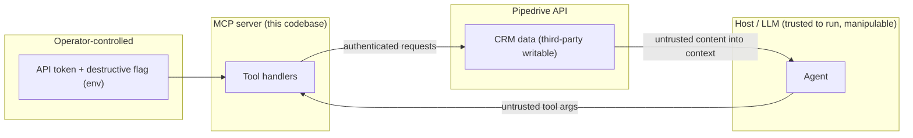

# Security & Vulnerability Analysis Requirements

## Summary

Run a focused security pass on the now publicly-distributed Pipedrive MCP server: build a threat model of its real runtime attack surface, produce a prioritized findings list (kept private), and fix the concrete code-level vulnerabilities. Give contemporary AI/agent attack surfaces first-class treatment with a server/host/operator-classified catalog, low-cost server-side mitigations, and public end-user guidance. No vulnerability detail reaches the public repository before its fix ships.

---

## Problem Frame

The package is now public on npm and the MCP registry. That changes the exposure profile in two ways. First, capable frontier models (for example Anthropic's Fable family) are proven at automated vulnerability discovery, so we should assume this repository will be probed by AI-driven analysis, not just read by humans. The bar for "robust" rises accordingly, and it makes premature public disclosure of any finding actively dangerous.

Second, this server is a textbook component of the "lethal trifecta": it holds a powerful account-wide Pipedrive token (access to private data), it ingests untrusted third-party content through CRM records (web lead forms, synced inbound email, anything a stranger can write into the account), and it can take actions including writes and deletes. Any one of those alone is manageable; together they are the configuration that turns a manipulated agent into real data loss or exfiltration.

The table-stakes posture already exists (SECURITY.md, a secret-scan CI workflow, Dependabot, committed lockfile, npm provenance with OIDC trusted publishing, a `dist`-only publish allowlist). This pass therefore targets the runtime code surface and the AI/agent threat class, not the baseline posture.

---

## Threat Model

The transport is STDIO only, so there is no inbound network listener and no remote transport attack surface. The realistic adversary acts through two channels: untrusted **tool arguments** supplied by the host/LLM, and untrusted **data flowing back** from the CRM into the agent's context.

Actors and trust boundaries:

- A1. **Operator** controls the environment (the API token and `PIPEDRIVE_ENABLE_DESTRUCTIVE`). Trusted, but needs guidance to configure safely.
- A2. **Host/LLM** is trusted to execute but can be manipulated by untrusted content into issuing unintended tool calls.
- A3. **Third-party content author** writes into the connected Pipedrive (lead forms, inbound email). Untrusted; the source of indirect prompt injection.
- A4. **Automated/AI analyst** probes the public repository and issues for exploitable patterns. Reason to never disclose unfixed findings.

---

## Key Decisions

- **Assess before fixing.** Produce the threat model and a prioritized private findings list first; fixes follow. The threat model is a durable artifact and prioritization prevents scattershot patching.
- **Reduce blast radius, do not claim to eliminate.** AI-class risks get cheap server-side mitigations where they measurably help, with residual risk documented. Free-form CRM text cannot be stripped of natural-language instructions without breaking the data, so honesty about the trust boundary beats false assurance.
- **Cheap mitigations only this pass.** Anything requiring architectural change is deferred and documented, keeping carrying cost low.
- **No public disclosure before a fix ships.** Findings and exploit detail live in a local gitignored `docs/private/` directory; public outputs are guidance only. The previously-used private backup repo is archived, so private detail stays local-only. Assume hostile automated analysis of the public repo and its issues.
- **Frame AI threats by capability, not product names.** Capability framing (frontier models can drive automated vulnerability discovery and sophisticated injection) ages better and stays accurate.
- **Treat the baseline posture as done.** The existing SECURITY.md baseline, secret-scan workflow, Dependabot, provenance/OIDC, and publish allowlist are not re-litigated here.

---

## Requirements

### Code-level vulnerability hardening

- R1. The Pipedrive API token must not be exposable through any log line, returned error, or thrown-exception surface, in either API version. This explicitly covers the v1 query-parameter auth path and the network/timeout error handling, where a stringified request URL could carry the token.
- R2. Every user-supplied value interpolated into a request path must be constrained by a strict allowlist or be a type-guaranteed integer, matching the existing `field_code` control. No string path segment may redirect or mangle the resolved URL.
- R3. Input validation must be uniform across all tools: every argument is validated, and free-form string and array inputs carry bounded sizes so a single call cannot drive resource exhaustion.
- R4. The path that maps and returns API error responses to the model is reviewed so it discloses no more than necessary about the account or backend.

### AI / agent attack-surface treatment

- R5. The threat model catalogs each contemporary AI/agent attack surface relevant to this server (indirect prompt injection, data exfiltration via tool chaining, confused-deputy / token misuse, excessive agency) and classifies each as server-fixable, host/model responsibility, or operator-managed.
- R6. Low-cost server-side mitigations are adopted where they reduce blast radius: untrusted CRM content returned in tool output is clearly labeled or delimited so the model can distinguish data from instructions; tool responses are size-capped; destructive operations remain disabled by default.
- R7. Residual AI risks the server cannot fix are documented honestly as host/model-level or operator-managed, not papered over as solved.
- R8. Public end-user security guidance (SECURITY.md and README) gives operators concrete best practices: generate the API token from a dedicated, non-admin Pipedrive user whose permission set and visibility groups are restricted to the minimum the integration needs (personal API tokens carry no token-level scopes, so the owning user's permission set is the only lever); run with destructive operations disabled; treat CRM data as untrusted input; and isolate the agent context.

### Disclosure and artifact handling

- R9. No vulnerability detail is published in the public repository before its fix ships: no public issues describing the flaw, no exploit detail in the public tree.
- R10. Concrete findings and full threat-model detail with exploit specifics live only in a local gitignored `docs/private/` directory; a fix and its corresponding finding land together.
- R11. Public-facing artifacts (this requirements doc, SECURITY.md/README guidance, any defended-model summary) stay at the approach level and carry no exploit detail.

### Assessment and verification

- R12. The pass produces a prioritized findings list (private) that ranks each issue by severity and exploitability before fixes begin.
- R13. Each fix is covered by a test asserting the vulnerable behavior is closed, aligned with the existing vitest unit/integration split.

---

## Acceptance Examples

- AE1. **Covers R2.** **Given** a tool argument used as a path segment containing a URL-significant character (backslash, dot-segment, or query/fragment character), **When** the tool is invoked, **Then** validation rejects it before any request URL is built.
- AE2. **Covers R1.** **Given** v1 auth carrying the token in the query string, **When** a network or timeout error is induced, **Then** the token appears in neither the error returned to the model nor any stderr log line.
- AE3. **Covers R6.** **Given** a CRM record whose text field contains instruction-like content, **When** it is returned through a tool, **Then** the untrusted content is delimited or labeled in the output so it is distinguishable from server-authored text.

---

## Scope Boundaries

### Deferred for later

- Broader supply-chain hardening: pinning GitHub Actions by commit SHA, and an `npm audit` / dependency-vulnerability CI gate. Revisit if a finding promotes it.
- Architectural changes beyond low-cost, such as a structured or quarantined tool-output channel, or OAuth 2.0 scoped authentication as an alternative to the personal API token (the only path to granular per-resource scopes).

### Outside this codebase's responsibility

- Host/model-level defense against prompt injection. That is the consuming agent's job; we document it and guide operators.
- Transport and network hardening. STDIO has no inbound network surface.
- Pipedrive-side access control and the token's underlying scope. Operator-managed, bounded by what Pipedrive offers.

---

## Dependencies / Assumptions

- The host/LLM is trusted to run but assumed manipulable through untrusted content; the operator controls the environment.
- Pipedrive personal API tokens (`api_token`) have no token-level scope selection (confirmed): a token inherits the full permission set of its owning user, and only one active token per user exists at a time. Least privilege is therefore achieved by minting the token from a dedicated restricted, non-admin user (bounded by that user's permission set and visibility groups), not at the token level. Granular per-resource scopes exist only via OAuth 2.0, which this server does not currently use.
- CRM data is assumed third-party-writable (web forms, synced email) and therefore untrusted.

---

## Success Criteria

- Every string path segment is allowlist-constrained or type-guaranteed numeric, and a malformed segment is rejected before any request.
- The API token cannot be surfaced via induced errors, timeouts, or logs in either API version.
- The AI attack-surface catalog classifies every listed risk, and operator best-practices ship publicly.
- No exploit detail exists anywhere in the public tree; findings are reproducible only from `docs/private/`.
- Each fix carries a regression test and the full suite stays green.

---

## Outstanding Questions

### Deferred to planning

- Whether to add optional OAuth 2.0 scoped authentication as a future enhancement, since it is the only path to granular per-resource scopes (the personal `api_token` cannot be scoped at the token level).
- The exact form of the untrusted-content delimiter or labeling in tool output (R6).
- Whether response size caps belong at the client layer or the per-tool formatting layer (R6).

---

## Sources / Research

- `src/client.ts` — request, auth, and error paths; v2 header auth versus v1 query-parameter token; `networkError` logging behavior.
- `src/config.ts` — environment validation for the API key and destructive flag.
- `src/utils/errors.ts` — error mapping, `destructiveOperationGuard`, and reflection of API error bodies.
- `src/schemas/fields.ts` — the existing `field_code` allowlist and its documented rationale; the model to extend in R2.
- `src/tools/` — path-interpolation sites for string segments (for example `deals.ts`, `leads.ts`, `organizations.ts`).
- `src/index.ts` — the central Zod validation dispatch in `handleCallTool`.
- `SECURITY.md`, `.github/workflows/secret-scan.yml`, `.github/dependabot.yml` — the existing posture baseline treated as done.
