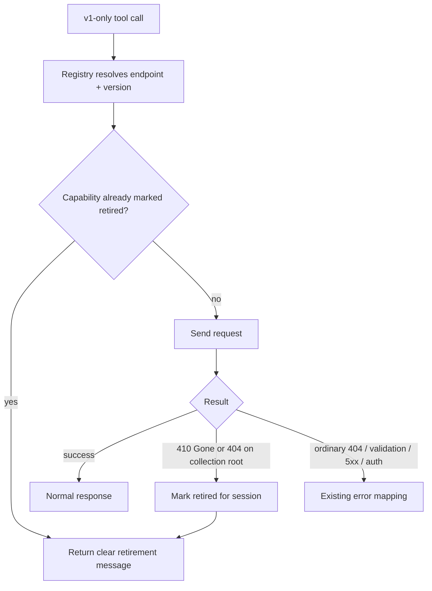

# v1 Version-Routing Seam & Sunset Safety

## Summary

Introduce a central registry for the four v1-only capabilities (Notes, Mail, Users list/get/me, Leads-CRUD) that makes them version-aware and retirement-aware. When Pipedrive eventually retires API v1, a call returns one clear "this surface was retired, no v2 equivalent" message instead of a cryptic upstream error, and operators get a once-per-session log warning that these tools ride v1. v2 call sites are untouched.

---

## Problem Frame

The server pins API version at every call site: each tool calls `client.get(endpoint, params, "v1")` or `"v2"` and the client (`src/client.ts`) only switches base URL and auth on that argument. There is no central place that knows which endpoints are v1, which are at risk, or what to do when one disappears.

Two facts make that a liability. First, everything that *had* a v2 equivalent is already migrated; the only v1 traffic left is the four capabilities in `docs/v1-only-capabilities.md` — Notes, Mail, Users list/get/me, and Leads-CRUD (19 tools) — and those have **no v2 target at all** (verified against the vendored specs, retrieved 2026-06-08). So there is nothing to "migrate to" today; migration is blocked on Pipedrive publishing endpoints.

Second, v1 retirement is coming on an uncertain but real horizon (partner sources cite 2026-07-31; Pipedrive's own docs promise only a grace period of at least one year). When it lands, those 19 tools will start returning raw upstream errors scattered across sessions, with no coherent signal to the agent or operator about what happened. The cost is a confusing, hard-to-diagnose failure spread across four capabilities rather than one recognizable "this was retired" outcome — and, today, a version decision that lives as error-prone string literals across the tool files.

---

## Key Decisions

- **This is sunset resilience plus a centralized seam, not a migration.** The four v1-only capabilities have no v2 equivalent, so there is no route to flip. The work hardens the eventual failure and centralizes the version decision; actual migration waits on Pipedrive (see Dependencies and Scope Boundaries).
- **Registry scope is the v1-only endpoints, not all endpoints.** It targets exactly the at-risk surface. v2 call sites stay as literals because their version will not change; folding them in is deferred (expandable later).
- **Detection is lazy, not a startup probe.** Retirement is recognized from the actual call result, so there is zero boot cost, no speculative network calls, and no false-drop from a transient error. The accepted cost is that the agent may attempt a since-retired tool once before it is marked retired.
- **Telemetry is operator-only, not model-facing.** A once-per-session stderr warning keeps the deprecation signal in the logs where it is actionable, and keeps the model's context clean. The model only encounters a v1 issue at actual retirement, via the clear message in R6.

---

## Requirements

### Central version registry

- R1. A central registry declares each v1-only endpoint (Notes, Mail, Users list/get/me, Leads-CRUD) with its API version and an at-risk marker, replacing the per-call-site `"v1"` literal for those endpoints.
- R2. v2 call sites remain unchanged; the registry covers only the v1-only endpoints.
- R3. The registry keys on endpoints (operations), not whole tools: a tool that mixes versions routes only its v1-only operations through the registry. Leads is the live case — CRUD stays on v1 while search and convert already use v2 (`src/tools/leads.ts`).

### Sunset detection and messaging

- R4. The server detects v1 retirement lazily at call time, with no startup probe. A retirement signal on a registered v1-only endpoint marks that capability retired for the process lifetime, so subsequent calls short-circuit without another upstream request.
- R5. Retirement detection fires only on a signal that the surface itself is gone — a 410 Gone, or a 404 on the collection root — never on an ordinary "record not found" 404, a validation error, or a transient 5xx/auth failure.
- R6. When a registered v1-only endpoint is retired, the tool returns one clear, structured message stating the capability was retired by Pipedrive and has no v2 equivalent, rather than reflecting the raw upstream error.

### Deprecation telemetry

- R7. Each v1-only capability emits a once-per-session operator-facing warning to stderr noting it rides Pipedrive API v1 with no v2 equivalent. No per-call repetition, and no model-facing notice on tool responses.

---

## Key Flow

- F1. v1-only call with lazy retirement detection
  - **Trigger:** a v1-only tool handler issues a request for a registered endpoint.
  - **Steps:** the registry resolves the endpoint's version and at-risk status; the request is sent; on success the normal response returns; on a retirement signal (R5) the capability is marked retired and the clear retirement message (R6) returns; on any other error the existing error mapping applies unchanged.
  - **Covered by:** R4, R5, R6.

---

## Acceptance Examples

- AE1. **Covers R5, R6.** **Given** a GET for a specific note id that does not exist (ordinary 404), **When** the tool runs, **Then** it returns the normal not-found error and Notes is **not** marked retired.
- AE2. **Covers R4, R5, R6.** **Given** a 410 Gone (or a 404 on the `/notes` collection root) on a registered v1-only endpoint, **When** the tool runs, **Then** it returns the "retired, no v2 equivalent" message and the capability is marked retired for the session.
- AE3. **Covers R4.** **Given** a capability marked retired earlier in the session, **When** the same tool is called again, **Then** it returns the retirement message without issuing another upstream request.
- AE4. **Covers R7.** **Given** multiple calls to several v1-only tools in one session, **When** they run, **Then** each v1-only capability logs its deprecation warning to stderr at most once.

---

## Scope Boundaries

### Deferred for later

- Actual v1→v2 migration of these four capabilities — blocked on Pipedrive publishing v2 endpoints; tracked separately (see `docs/v1-only-capabilities.md`, issue #47).
- Folding v2 endpoints into the registry — the registry may be shaped to expand, but v2 entries are not populated now.
- Marking v1-only tools as deprecated in the README or tool annotations — a cheap optional add, left out given the operator-telemetry-only choice (see Outstanding Questions).

### Outside this work

- General client resilience (retry, 429/`Retry-After` backoff, caching) — a separate track.
- Model-facing per-call deprecation notices on tool responses.
- A startup capability probe.

---

## Dependencies / Assumptions

- Migration of the four capabilities depends on Pipedrive shipping v2 equivalents for `/notes`, `/mailbox`, `/users` (list/get/me), and `/leads` CRUD; none exist as of the vendored specs retrieved 2026-06-08.
- The sunset date is uncertain. The first-party 2025-12-31 deprecation covers only selected endpoints that already have v2 equivalents (not these four). Partner sources (Make, Zapier) cite 2026-07-31 for full v1 retirement; Pipedrive's own docs promise only a grace period of at least one year. Re-verify against the changelog before relying on any date.
- "Retired for the session" assumes the singleton client / process lifetime is the session boundary, which holds for the one-process-per-session STDIO server.

---

## Outstanding Questions

### Deferred to Planning

- Confirm the exact retirement signal Pipedrive returns at sunset (410 Gone vs a 404 on the collection root) and pick the precise discriminator so R5 cannot fire on ordinary not-found responses.
- The registry's home and shape (where it lives, how endpoints are keyed, how a handler opts an operation into it).
- Whether to also mark v1-only tools as deprecated in the README / tool annotations as a low-cost complement to the stderr telemetry.

---

## Sources / Research

- `docs/v1-only-capabilities.md` — the four capabilities with no v2 target, the two sunset dates and their authority, and the per-claim spec citations.
- `src/client.ts` — the current per-call `ApiVersion` argument, the base-URL/auth switch (`getBaseUrl`, `applyAuth`), and the `networkError`/`parseResponse` path where detection and messaging would hook.
- `src/tools/notes.ts`, `src/tools/mail.ts`, `src/tools/users.ts`, `src/tools/leads.ts` — the v1-only call sites; `leads.ts` is the mixed-version case.
- Pipedrive changelog (deprecation announcements): https://developers.pipedrive.com/changelog
- Partner transition notices (partner-sourced 2026-07-31 horizon): Make and Zapier v1→v2 transition guides.
