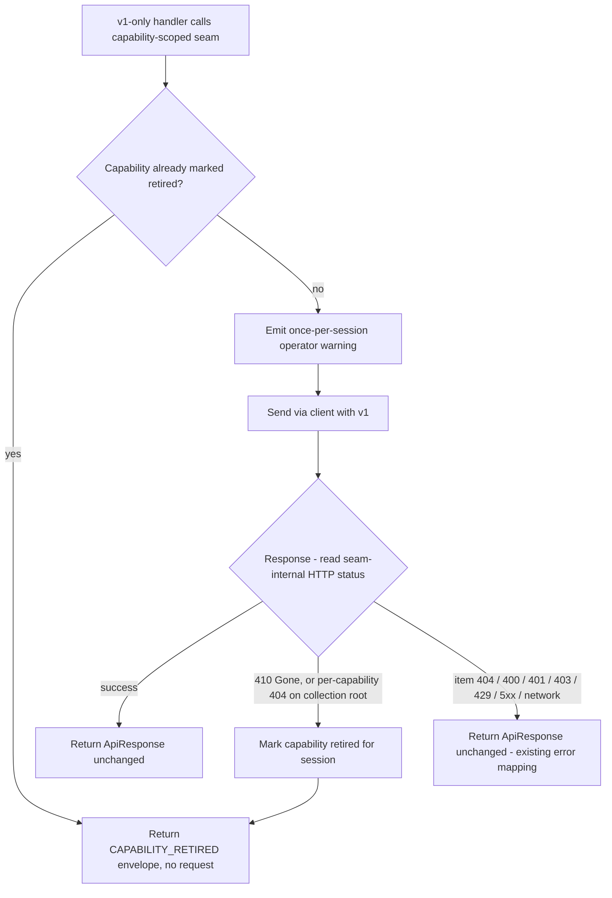

# feat: v1 version-routing seam and sunset safety

## Summary

Introduce one routing seam that owns the API-version decision for the four
v1-only capabilities (notes, mail, users list/get/me, leads CRUD). The v1-only
tool handlers call the seam instead of passing a `"v1"` literal; the seam
recognizes Pipedrive's eventual v1 retirement lazily from the call result,
returns one clear "retired, no v2 equivalent" message, and logs a
once-per-session operator warning. v2 call sites are untouched.

---

## Problem Frame

The server pins the API version at every call site — each handler calls
`client.get(endpoint, params, "v1")` or `"v2"`, and the client only switches
base URL and auth on that argument (`src/client.ts`). Nothing central knows
which endpoints are v1, which are at risk, or what to do when one disappears.

Everything that had a v2 equivalent is already migrated. The only v1 traffic
left is the four capabilities in `docs/v1-only-capabilities.md` — notes, mail,
users list/get/me, and leads CRUD — and none has a v2 target today, so there is
nothing to migrate to (migration is blocked on Pipedrive). v1 retirement is
coming on an uncertain horizon (partner sources cite 2026-07-31; Pipedrive's
own docs promise only a grace period of at least one year). When it lands,
those tools will return raw upstream errors scattered across sessions with no
coherent signal about what happened. This plan hardens that failure and
centralizes the version decision; it is sunset resilience, not a migration.

---

## Key Technical Decisions

- KTD1. **Opt-in routing seam over the client, not a client-embedded interceptor.**
  The v1-only handlers call the seam in place of the per-call-site `"v1"` literal,
  so the version decision moves to one place (R1) and the client stays a pure
  transport. Rejected alternative: detect inside `client.request()` gated on
  `version === "v1"` — it leaves the literals scattered (against R1) and couples
  the transport with capability semantics.
- KTD2. **The registry keys on operations, and each call site names its capability
  explicitly — resolution is not inferred from the path.** Prefix inference is
  ambiguous for this surface: mail's `/persons/{id}/mailMessages` and
  `/deals/{id}/mailMessages` collide with the live v2 `/persons` and `/deals`
  prefixes, and leads' `/leads/{uuid}` CRUD GET is indistinguishable from the v2
  `/leads/search` GET by prefix alone. So the handler routes through a
  capability-scoped seam, opting only its v1 operations in — leads CRUD goes
  through it while leads search and convert stay on v2 (R2, R3) — and v2 paths can
  never be misrouted. The endpoint is still used, but only for the collection-root
  check inside the discriminator.
- KTD3. **410 Gone is the strong retirement signal; a 404 on a collection root is
  a conservative, per-capability secondary.** A single-record not-found, validation
  error, auth failure, rate-limit, 5xx, and network/timeout never trip retirement
  (R5). The 404 secondary is opt-in per capability and disabled where a collection
  root legitimately 404s for non-retirement reasons — mail's `/mailbox/mailThreads`
  returns 404 on inaccessible threads, so mail relies on 410 only. The exact sunset
  signal is unverifiable until Pipedrive retires v1, so the discriminator is built
  to be tuned (see Open Questions).
- KTD4. **Capture the HTTP status from the raw response before JSON parsing, and
  keep it seam-internal.** `ApiResponse` discards the numeric status today, and the
  body is read with `await response.json()` inside the same `try` that catches
  network errors — so a 410 or 404 with an empty or non-JSON body, exactly what a
  retired endpoint is likely to return, throws at parse time and is misclassified as
  a status-less network error. Capture `response.status` from the fetch `Response`
  before parsing, and let a non-OK response with an unparseable body still yield a
  status-bearing error. Expose the status to the seam through a seam-internal
  channel rather than widening the shared `ErrorResponse` (which every tool's
  rendered output flows through); the network/timeout path carries no status, which
  is what keeps transient failures from looking like retirement.
- KTD5. **The retirement message rides the existing error path.** A new
  `CAPABILITY_RETIRED` error code flows through `mcpErrorResult`, so the handlers'
  existing `if (!response.success) return mcpErrorResult(response)` branch surfaces
  the clear message with no error-branch rewrite (R6).
- KTD6. **Session state is module-level for the process lifetime.** The retired set
  and the warned set are keyed by capability and live for the process — valid
  because the STDIO server is one process per session. Telemetry is operator-only
  stderr, at most once per capability (R7). A reset hook is exported for test
  isolation (mirrors the `getClient()` singleton-state concern).

---

## High-Level Technical Design

A v1-only handler calls the seam (`v1.get` / `v1.post` / …) with the endpoint and
the usual arguments, minus the version. The seam resolves the capability, applies
the lazy-detection gates, and returns either the underlying `ApiResponse` or a
`CAPABILITY_RETIRED` envelope. Everything downstream of the handler is unchanged.

The `CAPABILITY_RETIRED` envelope reaches the model through the handler's existing
`mcpErrorResult` branch, so the only handler edit is dropping the `"v1"` literal in
favor of the seam call.

---

## Requirements

### Central version registry

- R1. A central registry declares each v1-only endpoint (notes, mail, users
  list/get/me, leads CRUD) with its API version and an at-risk marker, replacing
  the per-call-site `"v1"` literal for those endpoints.
- R2. v2 call sites remain unchanged; the registry covers only the v1-only
  endpoints.
- R3. The registry keys on endpoints (operations), not whole tools: a tool that
  mixes versions routes only its v1-only operations through the seam. Leads is the
  live case — CRUD stays on v1 while search and convert already use v2
  (`src/tools/leads.ts`).

### Sunset detection and messaging

- R4. The server detects v1 retirement lazily at call time, with no startup probe.
  A retirement signal on a registered v1-only endpoint marks that capability retired
  for the process lifetime, so subsequent calls short-circuit without another
  upstream request.
- R5. Retirement detection fires only on a signal that the surface itself is gone —
  a 410 Gone, or a 404 on the collection root — never on an ordinary "record not
  found" 404, a validation error, or a transient 5xx/auth failure.
- R6. When a registered v1-only endpoint is retired, the tool returns one clear,
  structured message stating the capability was retired by Pipedrive and has no v2
  equivalent, rather than reflecting the raw upstream error.

### Deprecation telemetry

- R7. Each v1-only capability emits a once-per-session operator-facing warning to
  stderr noting it rides Pipedrive API v1 with no v2 equivalent. No per-call
  repetition, and no model-facing notice on tool responses.

---

## Implementation Units

### U1. Capture HTTP status reliably and add the retirement error surface

- **Goal:** Give the seam a reliable HTTP status to discriminate on — even when a
  retired endpoint returns an empty body — and define the clear retirement error,
  without widening the shared error contract.
- **Requirements:** R6; enables R5.
- **Dependencies:** none.
- **Files:**
  - `src/client.ts`
  - `src/utils/errors.ts`
  - `tests/integration/client.test.ts`
  - `tests/unit/utils/errors.test.ts`
- **Approach:** In `src/client.ts`, separate network failure from body-parse
  failure: capture `response.status` from the fetch `Response` before calling
  `response.json()`, and handle an empty or non-JSON body on a non-OK response by
  still producing a status-bearing error instead of falling into the `networkError`
  path. A real 410/404 from a sunset endpoint may carry no JSON body, and today that
  throws at parse time and is lost as a status-less network error. Expose the
  captured status to the seam through a seam-internal channel (a client return shape
  or method the seam consumes) — do not add a field to the shared `ErrorResponse`,
  which feeds every tool's rendered output. In `src/utils/errors.ts`, add
  `CAPABILITY_RETIRED` to the `ErrorCode` union and a builder for the R6 message. The
  builder interpolates only the capability's static display name from the registry —
  never the caller-supplied endpoint — so no CRM-derived path segment enters the
  model-facing message (consistent with the untrusted-data posture in
  `formatToolResponse`). It renders through the existing `formatErrorForMcp` /
  `mcpErrorResult` path.
- **Patterns to follow:** the existing `parseResponse` / `networkError` split in
  `src/client.ts`; `createErrorResponse`, `mcpErrorFromCode`, the `ErrorCode` union,
  and the `boundErrorMessage` redaction discipline in `src/utils/errors.ts`.
- **Test scenarios:**
  - A non-OK response with a valid JSON body maps to the correct error code and
    exposes its status on the seam-internal channel (the 200 success path is
    unchanged).
  - A 410 with an empty or non-JSON body yields a status-bearing error carrying
    `410` — not a status-less `NETWORK_ERROR`. This is the retirement-at-sunset case
    R5 depends on.
  - A genuine network failure or timeout still produces `NETWORK_ERROR` with no
    status, and token redaction on that path is unchanged.
  - The `CAPABILITY_RETIRED` builder produces a message naming only the supplied
    display name; given a raw endpoint string, that string does not appear in the
    output. `formatErrorForMcp` renders code, message, and suggestion.
  - Regression: 400/401/403/404/429/500 mappings are unchanged; the public
    `ErrorResponse` shape is unchanged.
- **Verification:** client and errors suites green; a body-less 410 is classified
  retirement-eligible (status present); the public `ErrorResponse` shape is
  unchanged.

### U2. Version-routing registry and lazy-detection seam

- **Goal:** One module that owns the v1-only version decision, classifies
  retirement signals, holds session retired-state, emits the operator warning, and
  exposes the seam the handlers call in place of the version literal.
- **Requirements:** R1, R2, R3, R4, R5, R7.
- **Dependencies:** U1.
- **Files:**
  - `src/version-routing.ts` (new)
  - `tests/unit/version-routing.test.ts` (new)
- **Approach (directional, not implementation spec):** Declare the four
  capabilities (notes, mail, users, leads), each with a display name, an at-risk
  marker, and the set of collection-root endpoints eligible for the 404 secondary
  discriminator. Each v1-only operation is registered explicitly under its
  capability; the call site names the capability, so resolution is never inferred
  from the path (KTD2). Capability ownership:
  - notes — `/notes`, `/notes/{id}`
  - mail — `/persons/{id}/mailMessages`, `/deals/{id}/mailMessages`,
    `/mailbox/mailThreads`, `/mailbox/mailThreads/{id}`, `/mailbox/mailMessages/{id}`
  - users — `/users`, `/users/me`, `/users/{id}`
  - leads (CRUD only) — `/leads`, `/leads/{uuid}`; never `/leads/search` or
    `/leads/{id}/convert/*` (those stay on v2)

  Collection roots eligible for the 404 secondary: notes `/notes`; users `/users`
  and `/users/me`; leads `/leads`. Mail relies on 410 only — its thread list
  legitimately 404s on inaccessible threads. Provide:
  - a retirement classifier (R5) — given the seam-internal HTTP status (U1) and the
    operation, retirement iff the status is `410`, or the status is `404` and the
    operation is a 404-eligible collection root for its capability; everything else
    is not retirement.
  - module-level retired and warned sets keyed by capability, process lifetime, plus
    an exported reset for test isolation.
  - a once-per-session stderr warning per capability (R7). It logs only the
    server-authored capability name; any runtime value ever interpolated into it
    must pass through `redactSecrets` first (consistent with `client.ts`), though
    since the warning fires before the request is sent, no URL or token is in scope.
  - a capability-scoped seam (`get`/`post`/`put`/`patch`/`delete`) the handler calls
    in place of the `"v1"` literal: if the capability is already retired, return the
    `CAPABILITY_RETIRED` envelope without sending (R4); otherwise warn-once, send via
    the singleton client at `"v1"`, read the seam-internal status, mark retired and
    return the `CAPABILITY_RETIRED` envelope on a retirement signal (R6), else return
    the client's `ApiResponse` unchanged. The seam's `delete` maps to
    `client.delete(endpoint, "v1", body)` — the client places the version *before*
    the optional body, unlike the other four verbs where `"v1"` is the final
    argument.
- **Execution note:** Build the classifier and the retired/warned state machine
  test-first — the R5 discriminator is the subtle, high-risk core.
- **Patterns to follow:** the `getClient()` singleton, the client's `ApiResponse<T>`
  envelope, stderr-only logging via `console.error` (never stdout) routed through
  `redactSecrets`, and the U1 builders.
- **Test scenarios:**
  - Covers R5. Classifier: status `410` on any registered operation is retirement.
  - Covers R5 / AE1 / AE2. Classifier: status `404` on a 404-eligible collection root
    (notes `/notes`, users `/users` / `/users/me`, leads `/leads`) is retirement;
    `404` on an item (`/notes/123`, a `/leads/{uuid}`) is not; `404` on any mail
    operation is not (mail is 410-only).
  - Covers R5. Classifier: status 400, 401, 403, 429, 500, and a missing/undefined
    status (network) are not retirement.
  - Seam success: a 200 returns the underlying `ApiResponse` unchanged.
  - Covers R6 / AE2. The seam marks the capability retired on a `410` (and, where
    eligible, a collection-root `404`) and returns `CAPABILITY_RETIRED`.
  - Covers R4 / AE3. After a capability is retired, a second seam call for it returns
    the retirement envelope without invoking the client/fetch — assert the transport
    was not called again.
  - Covers R7 / AE4. Calls across notes and mail each log their warning exactly once
    — assert `console.error` counts per capability.
  - `delete` routing places `"v1"` before the optional body (matches the
    `client.delete` argument order).
  - The exported reset clears the retired and warned sets.
- **Verification:** version-routing unit suite green; the classifier rejects every
  non-retirement status (including a body-less 5xx and any mail 404); warned/retired
  state is observably once-per-session and resettable.

### U3. Route the v1-only call sites through the seam

- **Goal:** Replace the per-call-site `"v1"` literal in the four v1-only tool files
  with seam calls so detection, messaging, and telemetry apply, leaving v2
  operations untouched.
- **Requirements:** R1, R2, R3.
- **Dependencies:** U2.
- **Files:**
  - `src/tools/notes.ts` (5 operations)
  - `src/tools/mail.ts` (5 operations: `getPersonEmails` → `/persons/{id}/mailMessages`,
    `getDealEmails` → `/deals/{id}/mailMessages`, and the three `/mailbox/*`
    operations — all under the mail capability)
  - `src/tools/users.ts` (3 operations)
  - `src/tools/leads.ts` (CRUD only: list, list-archived, get, create, update,
    delete — 6 operations; search, convert, and conversion-status stay on the client
    at `"v2"`)
  - `tests/integration/tools/notes.test.ts`, `mail.test.ts`, `users.test.ts`,
    `leads.test.ts`
- **Approach:** Route each v1-only operation through its capability-scoped seam entry
  in place of the `"v1"` literal. The existing success-guard branch surfaces the
  `CAPABILITY_RETIRED` message unchanged. Mail's two non-`/mailbox` operations
  (`getPersonEmails`, `getDealEmails`) route under the mail capability — do not leave
  them on the raw `"v1"` literal. In `leads.ts`, route only CRUD through the seam;
  leave `searchLeads`, `convertLeadToDeal`, and `getLeadConversionStatus` calling the
  client with `"v2"` exactly as today (R2, R3). No tool-definition changes — no new
  tools, no `destructive` changes, no annotations — so `npm run gen:docs` has nothing
  to regenerate.
- **Patterns to follow:** the existing handler shape (getClient → call →
  success-guard → `formatToolResponse`) and the `leads.ts` mixed-version layout as
  the canonical example of operation-level routing.
- **Test scenarios (register the seam-state reset in shared test setup so all four
  suites stay isolated — see Risks):**
  - notes/mail/users/leads-CRUD list and get still produce normal success responses
    against a mocked 200 (no happy-path behavior change).
  - Covers AE1. A note get for a missing id (ordinary 404) returns the normal
    not-found error and notes is not marked retired.
  - Covers AE2 / R6. A 410 (or, for a 404-eligible capability, a collection-root 404)
    on a v1-only list returns the retirement message and marks the capability retired.
  - Covers AE3 / R4. A second call to the now-retired capability returns the
    retirement message with no new upstream request.
  - Covers R3. Mail's `getPersonEmails` and `getDealEmails` route under the mail
    capability, and a retired mail capability short-circuits all five mail operations
    while the v2 `/persons` and `/deals` tools stay unaffected.
  - Covers R2 / R3. Leads search still targets v2 and is unaffected when leads CRUD
    is marked retired — retiring CRUD does not short-circuit search.
  - Covers AE4 / R7. Calls across two capabilities each emit their stderr warning
    once.
- **Verification:** full tool integration suites green; v1-only operations route
  through the seam; v2 operations (deals/persons/etc. and leads search/convert) are
  unchanged; `npm run gen:docs` reports no drift.

### U4. Document the seam and resolve the deprecation-marking question

- **Goal:** Point future migration work at the version decision's new home and
  record the operator-only telemetry choice.
- **Requirements:** supports R1 traceability; resolves the deprecation-marking open
  question.
- **Dependencies:** U3.
- **Files:**
  - `docs/v1-only-capabilities.md`
- **Approach:** Add a short note that the v1 version decision and sunset detection
  now live in the routing seam (name the module), so a future migration flips
  registry entries there instead of hunting call sites. Record the resolution of the
  deprecation-marking question: README and tool-annotation "deprecated" marks are
  intentionally not added — telemetry stays operator-only, which keeps the model's
  context clean and `gen:docs` drift-free; revisit if model-facing signaling is later
  wanted.
- **Test expectation:** none — documentation only.
- **Verification:** the doc references the seam module and states the
  deprecation-marking decision; no code or tool-def changes, so the CI doc-drift
  check stays green.

---

## Acceptance Examples

- AE1. Covers R5, R6. Given a GET for a specific note id that does not exist
  (ordinary 404), when the tool runs, then it returns the normal not-found error and
  notes is not marked retired.
- AE2. Covers R4, R5, R6. Given a 410 Gone (or a 404 on the `/notes` collection
  root) on a registered v1-only endpoint, when the tool runs, then it returns the
  "retired, no v2 equivalent" message and the capability is marked retired for the
  session.
- AE3. Covers R4. Given a capability marked retired earlier in the session, when the
  same tool is called again, then it returns the retirement message without issuing
  another upstream request.
- AE4. Covers R7. Given multiple calls to several v1-only tools in one session, when
  they run, then each v1-only capability logs its deprecation warning to stderr at
  most once.

---

## Scope Boundaries

### Deferred for later

- Actual v1→v2 migration of the four capabilities — blocked on Pipedrive publishing
  v2 endpoints; tracked separately (`docs/v1-only-capabilities.md`, issue #47).
- Folding v2 endpoints into the registry — the registry may be shaped to expand, but
  v2 entries are not populated now.

### Deferred to follow-up work

- Marking v1-only tools as deprecated in the README or tool annotations — resolved
  out for now (operator-telemetry-only); a cheap optional add if model-facing
  signaling is later wanted.

### Outside this work

- General client resilience (retry, 429/`Retry-After` backoff, caching) — a separate
  track.
- Model-facing per-call deprecation notices on tool responses.
- A startup capability probe.

---

## Risks & Dependencies

- **The exact retirement signal is unverifiable until sunset.** Pipedrive may return
  410, a 404 on a collection root, or something else when v1 retires. The
  discriminator is conservative and built to be tuned (KTD3); re-verify against the
  changelog before relying on any date.
- **False-positive on a collection-root 404.** A 404 on a collection root from a
  non-retirement cause would wrongly mark a capability retired for the session.
  Mitigated because item not-found never trips it, 410 is the primary signal, and the
  404 secondary is opt-in per capability — mail, whose thread list 404s on
  inaccessible threads, is already 410-only. The residual risk can be removed
  entirely by going 410-only everywhere (see Open Questions). The blast radius is one
  session of one capability.
- **Migration dependency.** Migrating any of the four capabilities depends on
  Pipedrive shipping v2 equivalents for `/notes`, `/mailbox`, `/users` (list/get/me),
  and `/leads` CRUD; none exist as of the vendored specs (retrieved 2026-06-08).
- **Session-scope assumption.** "Retired for the session" equals the process
  lifetime, which holds for the one-process-per-session STDIO server.
- **Test-isolation footgun.** Module-level retired/warned state persists across tests
  in a worker (the same concern as the `getClient()` singleton), so an unreset warned
  set makes AE4's once-per-session assertion order-dependent. Register the U2 reset in
  shared test setup (e.g. alongside `setupValidEnv` or a global `beforeEach`) rather
  than relying on each of the four suites to remember it.

---

## Open Questions

- Confirm the exact retirement signal Pipedrive returns at sunset (410 Gone vs a 404
  on the collection root) and finalize the per-capability discriminator so R5 cannot
  fire on ordinary not-found responses. Default for now: 410 as the strong signal
  everywhere, plus a collection-root-gated 404 secondary for notes/users/leads but
  not mail (whose collection root 404s on inaccessible threads); the conservative
  fallback is 410-only everywhere until the real signal is observed. This is a
  verification-time unknown, not a blocker for building the seam.

---

## Sources / Research

- `docs/v1-only-capabilities.md` — the four capabilities with no v2 target, the two
  sunset dates and their authority, and the per-claim spec citations.
- `src/client.ts` — the per-call `ApiVersion` argument, the base-URL/auth switch
  (`getBaseUrl`, `applyAuth`), and the `parseResponse` / `networkError` paths.
  `parseResponse` maps the HTTP status to an error code and discards the numeric
  status, and `await response.json()` runs inside the same `try` that catches network
  errors — so a body-less error response is currently lost as a network error (both
  motivate KTD4).
- `src/utils/errors.ts` — `handleApiError` (the single status→error chokepoint where
  410 currently falls to the `API_ERROR` default), the `ErrorCode` union, and
  `mcpErrorResult` / `formatErrorForMcp` (the path the retirement message rides).
- `src/tools/notes.ts`, `src/tools/mail.ts`, `src/tools/users.ts`,
  `src/tools/leads.ts` — the v1-only call sites. `mail.ts` spreads its five v1
  operations across `/persons/{id}/mailMessages`, `/deals/{id}/mailMessages`, and
  `/mailbox/*`, and `leads.ts` is the mixed-version case (CRUD on v1; search/convert
  on v2) — both are why resolution is capability-named, not prefix-inferred (KTD2).
- `tests/integration/client.test.ts`, `tests/integration/tools/` — the
  `mockFetch`/`mockApiSuccess`/`mockApiError` helpers and per-tool integration
  patterns the new tests follow.
- Pipedrive changelog (deprecation announcements): https://developers.pipedrive.com/changelog
- Partner transition notices (partner-sourced 2026-07-31 horizon): Make and Zapier
  v1→v2 transition guides.
</content>
</invoke>
