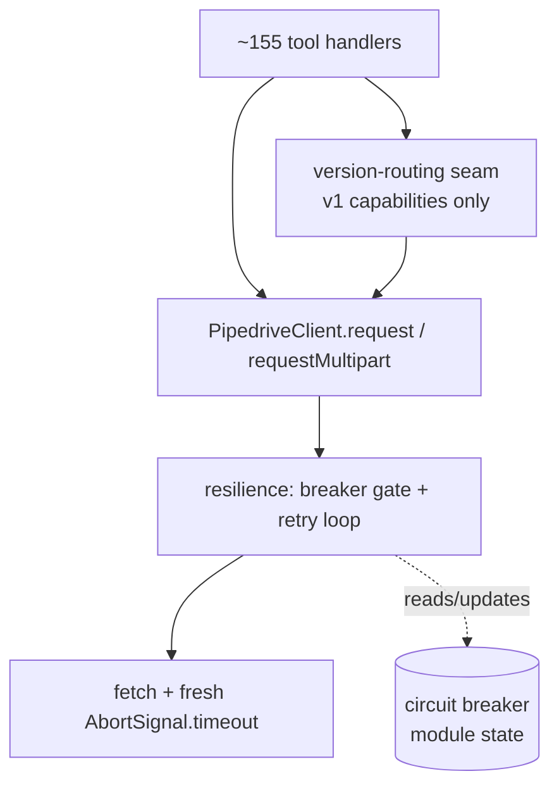
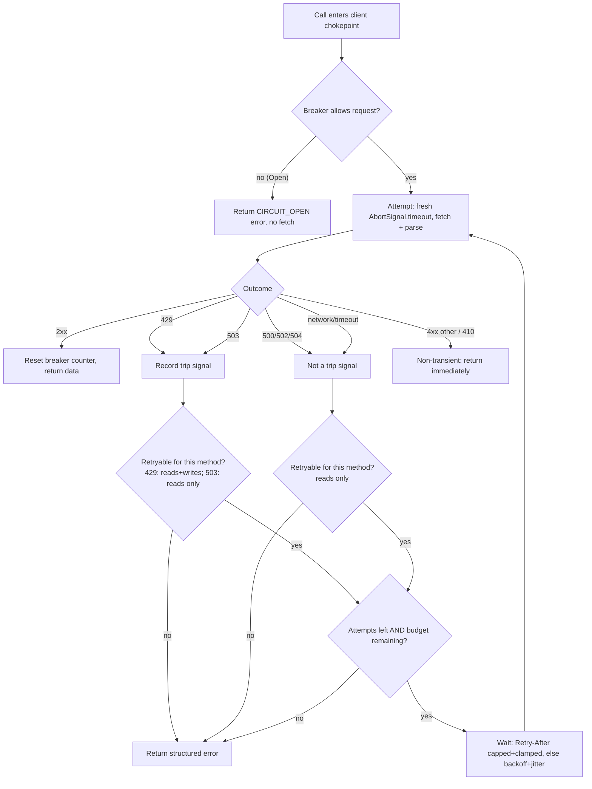
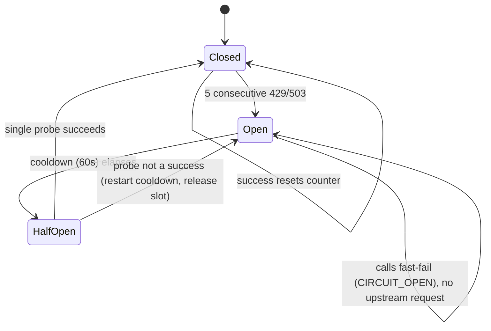

# feat: Resilient request core (retry + circuit breaker)

## Summary

Add a resilience layer below the client's `fetch` so every tool hardens at once: automatic retry of transient failures with bounded exponential backoff and jitter that honors Pipedrive's `Retry-After`, plus a per-process circuit breaker that fast-fails during a sustained rate-limit or service-unavailable storm. Reads retry on any transient failure; writes retry only on 429. The logic lands in a new `src/resilience.ts` module wired into `request()` / `requestMultipart()`, leaving the version-routing seam and all 155 tool handlers untouched.

---

## Problem Frame

`src/client.ts` issues a single `fetch` guarded only by a 30s `AbortSignal` timeout (`REQUEST_TIMEOUT_MS`). There is no retry, no 429 handling, and no breaker. A 429 maps straight to `RATE_LIMITED` with a static "wait 60 seconds" suggestion (`handleApiError`, `src/utils/errors.ts:162`); a transient network blip maps to `NETWORK_ERROR` (`networkError`, `src/client.ts:134`). In both cases the agent must notice and retry by hand.

The acute risk is a runaway agent loop: with no backoff and no breaker it can hammer a rate-limited endpoint and exhaust the account's *shared* daily token budget, degrading the human's own Pipedrive usage, not just the MCP session. This is preventive hardening (no observed incident), but it is the most likely production failure for an agentic CRM wrapper, and fixing it at the chokepoint multiplies across every current and future tool.

---

## Requirements

Carried from the origin brainstorm (`see origin`) with the planning-phase open questions now resolved (503 trip, distinct error code, concrete tuning).

### Retry behavior

- R1. The shared request chokepoint retries transient failures automatically. Tools route through it unchanged and observe only the final result.
- R2. Reads (GET) retry on any transient failure: 429, 503, other 5xx, and network/timeout.
- R3. Writes (POST / PATCH / PUT / DELETE, including the multipart upload path) retry only on 429; never on network, timeout, or any 5xx (including 503).
- R4. Retries use bounded exponential backoff with jitter and a capped attempt count. They honor `Retry-After` but cap any single wait and the total added wall-clock, after which a clear error surfaces instead of further retries.
- R5. Non-transient responses (4xx other than 429, and the retirement 410) are never retried; they return immediately so the version-routing seam's retirement detection is unaffected.

### Circuit breaker

- R6. A per-process circuit breaker trips after a configured number of consecutive trip signals (429 or 503), fast-failing subsequent calls without an upstream request during a cooldown, then half-opening with a single probe before closing.
- R7. While the breaker is open, calls return a clear, structured backing-off error to the model rather than a raw upstream error or a hang.
- R10. A 503 (service unavailable) counts toward the breaker trip threshold alongside 429, so a sustained Pipedrive outage also fast-fails. Generic 5xx (500 / 502 / 504) does not count toward the threshold (those can land after a write was applied and are handled by the read-only retry budget).
- R11. The breaker-open fast-fail returns a new distinct error code, not the existing `RATE_LIMITED`, so the model and stderr telemetry can tell a local fast-fail apart from a fresh upstream 429.

### Telemetry and testability

- R8. Retry attempts and breaker state transitions log to stderr only (never stdout), routed through the existing secret-redaction so no token or request URL can leak.
- R9. The breaker's process-level state is resettable for test isolation, mirroring `resetVersionRoutingState()` (`src/version-routing.ts:123`) and the client singleton.

---

## Key Technical Decisions

- KTD1. **Resilience lives in a new `src/resilience.ts` module; the client owns the loop.** The module holds the pure primitives (retry classifier, backoff, `Retry-After` parsing) and the stateful breaker (module-level state plus an exported reset). `request()` / `requestMultipart()` call a single shared private retry method that drives the loop and does the fetch. Rationale: keeps fetch/transport concerns in the client and the testable resilience logic isolated, mirroring how `version-routing.ts` separates routing state from transport. (see origin: KD5)

- KTD2. **Read/write retry asymmetry is the idempotency strategy; no idempotency keys.** A 429 is a pre-processing rejection, so retrying it cannot duplicate a write. A network error, timeout, or 5xx on a write is ambiguous (the write may have landed, the response lost), so writes never retry on those. Reads are safe to retry on any transient signal. Pipedrive documents no idempotency-key mechanism, so request fingerprinting is out. (see origin: KD1)

- KTD3. **A total added-wall-clock budget is the master limiter; the 30s per-attempt timeout stays as a cap.** Elapsed is measured from the first attempt's start, and both attempt durations and inter-attempt waits debit `RETRY_BUDGET_MS`. The initial attempt uses the full `REQUEST_TIMEOUT_MS` (30s); each retry attempt uses `min(REQUEST_TIMEOUT_MS, budget remaining)`, so later attempts genuinely shrink and no new attempt starts once the budget is spent. For the common 429 case attempts are fast, so the budget goes to backoff and `Retry-After` waits. The all-timeouts read path is bounded at roughly the initial 30s plus the 30s budget (~60s). The breaker does not bound this per-call latency (it acts across calls, not within one); the multi-call compounding limit is in Risks. This honors the brainstorm's "30s per-attempt stays; budget bounds the sum." (see origin: KD2)

- KTD4. **Tuning is centralized hardcoded constants, not env vars.** Named `const`s in `src/resilience.ts` (matching `REQUEST_TIMEOUT_MS` in `client.ts` and `BACKOFF_DELAYS_MS` in `leads.ts`). Starting values: `RETRY_MAX_ATTEMPTS = 4` (1 initial + 3 retries); `RETRY_BUDGET_MS = 30_000` (added wall-clock); `BACKOFF_BASE_MS = 500`; `BACKOFF_CAP_MS = 8_000` (single computed-backoff cap); `RETRY_AFTER_CAP_MS = 20_000` (single honored `Retry-After` cap); `BREAKER_THRESHOLD = 5`; `BREAKER_COOLDOWN_MS = 60_000`. These are expert knobs that, if mis-set, reintroduce the stall / quota-exhaustion failure this work prevents, so they are not exposed to end users. Centralizing them in one module makes promoting any single knob to a `config.ts` accessor later a localized change.

- KTD5. **Full jitter on exponential backoff.** `wait = random(0, min(BACKOFF_CAP_MS, BACKOFF_BASE_MS * 2^attemptIndex))`. AWS's published comparison shows no-jitter is the clear loser and any jitter beats none; full jitter is the simplest correct choice for a single-process server where the fleet thundering-herd argument is weak. The randomness source is a parameter of the pure backoff function (default `Math.random`) so unit tests pin it deterministically.

- KTD6. **`Retry-After` parsed defensively with a header fallback chain and a strict cap-then-bail order.** Parse `Retry-After` as delta-seconds first, then as an HTTP-date (RFC 7231 allows both), clamping any negative (clock-skew / past-date) result to 0. When `Retry-After` is absent or unparseable, honor `x-ratelimit-reset` (seconds) before falling back to plain capped backoff: Pipedrive's current first-party docs no longer list `Retry-After`, so `x-ratelimit-reset` is the server's real reset hint and is worth honoring over a blind backoff guess. The wait order is exact: (1) take the raw hint; (2) cap it at `RETRY_AFTER_CAP_MS`; (3) if the capped wait exceeds the remaining budget, surface the structured error now rather than sleeping a truncated wait into a likely second 429; (4) otherwise sleep the capped wait and debit it from the budget before the next attempt check. (see origin: Dependencies / Assumptions; AE3)

- KTD7. **Breaker is a consecutive-count machine tripped by 429 + 503; half-open allows one single-attempt probe.** A consecutive counter suits a single, bursty process: one success resets it, so isolated 429s never accumulate. Trip signals are 429 and 503 (R10). Closed -> (threshold consecutive trip signals) -> Open -> (cooldown) -> Half-Open -> (one probe) -> Closed or Open. The half-open probe runs as a single upstream attempt with internal retry disabled, so one probe is exactly one request against the service the breaker is protecting. The probe holds a one-slot gate (set synchronously) so two concurrent calls cannot both probe, and the slot is always released when the probe settles. Any non-success probe outcome (4xx, 5xx, network, or timeout, not only 429/503) reopens the breaker and restarts the cooldown; a success closes it and resets the counter. Cooldown timing reads wall-clock. (see origin: KD3)

- KTD8. **Multipart retry re-sends the in-memory body; public signatures stay stable.** The only multipart body is the `Blob`-backed `FormData` from `buildImageFormData` (`src/tools/products.ts`), held in memory and re-readable, so the retry driver can re-send the same instance across attempts; undici only fails to rewind *stream-backed* parts, which this path does not use. `postMultipart()` / `putMultipart()` keep accepting a `FormData` (no public API change, no call-site change at either the upload or update site), and the no-manual-Content-Type rule (`src/client.ts:317`) is preserved on each re-send. Writes retry on 429 only, so a re-send fires rarely. A `() => FormData` factory is deferred until a genuine stream-backed body appears. (see origin: Dependencies / Assumptions)

- KTD9. **Tests use parameter injection for pure functions and vitest timer control for the stateful loop.** The pure backoff function takes an injectable rng; the classifier and `Retry-After` parser take plain inputs. The retry loop's sleep and the breaker's clock are exercised with vitest fake timers (`vi.useFakeTimers()` / `vi.setSystemTime()`) so no real waits occur and cooldown is deterministic. This applies `leads.ts`'s injectable-`sleep` philosophy (avoid real waits in tests) while keeping production code free of mutable test-only globals. Timeout-path cases are driven by a throwing fetch mock (`mockFetchNetworkError`) rather than a real `AbortSignal` abort, so the fake clock and the abort primitive never need to interact; because the loop awaits the fetch mock between sleeps, timer tests interleave `vi.advanceTimersByTimeAsync` with microtask flushes. The breaker state reset (`resetCircuitBreakerState()`) is wired into `tests/setup.ts` `beforeEach` alongside `resetVersionRoutingState()`. (Alternative weighed in Alternatives Considered.)

---

## High-Level Technical Design

### Layering: resilience sits below the seam

Every tool reaches `fetch` through the client. The v1-only capabilities pass through the version-routing seam first; v2 tools call the client directly. Both land in the same chokepoint, so retry and breaker wrap `fetch` *below* the seam, and the seam sees only the final post-retry result (KD5 / R5).

### Per-call retry decision

The wait/retry step is suppressed for a half-open probe: that probe is a single attempt (KTD7), so it runs the gate and one attempt, then settles the breaker without looping.

### Circuit breaker state machine

A subtlety the loop must order correctly: a write retries on 429 *and* a 429 is a breaker trip signal. The sequence per attempt is: consult breaker -> if closed/half-open-probe, attempt -> record outcome -> decide retry within budget. So repeated 429s on a retrying write both retry (within attempts/budget) and accumulate toward the trip threshold; once open, the next call fast-fails.

---

## Implementation Units

### U1. Retry primitives in `src/resilience.ts`

- **Goal:** Establish the new module with the pure, stateless resilience building blocks: tuning constants, outcome classifier, backoff computation, and `Retry-After` parsing.
- **Requirements:** R2, R3, R4, R5, R10 (classifier shape).
- **Dependencies:** none.
- **Files:**
  - `src/resilience.ts` (new) — constants (KTD4); `classifyOutcome({ method, httpStatus, isNetworkError })` returning `{ retryable, isTripSignal }`; `computeBackoffMs(attemptIndex, rng?)` (full jitter, KTD5); `parseRetryAfterMs(headers, nowMs)` (KTD6).
  - `tests/unit/resilience.test.ts` (new).
- **Approach:** Pure functions only, no module state and no fetch. The classifier encodes the R2/R3/R5/R10 table: 429 -> retryable for any method, trip signal; 503 -> retryable reads only, trip signal; 500/502/504 -> retryable reads only, not a trip signal; network/timeout -> retryable reads only, not a trip signal; 410 and other 4xx -> not retryable, not a trip signal; 2xx -> not retryable (caller treats as done/success). `parseRetryAfterMs` reads `Retry-After` (delta-seconds then HTTP-date, clamp negatives to 0), falls back to `x-ratelimit-reset`, returns `null` when neither is usable. `computeBackoffMs` caps at `BACKOFF_CAP_MS` and takes an injectable rng.
- **Patterns to follow:** `Headers.get` is case-insensitive and returns `null` when absent. Constant style mirrors `REQUEST_TIMEOUT_MS` (`src/client.ts:34`).
- **Test scenarios:**
  - classifyOutcome, reads: GET+429 -> {retryable:true, trip:true}; GET+503 -> {true, true}; GET+500 -> {true, false}; GET+502 -> {true, false}; GET+504 -> {true, false}; GET+network -> {true, false}; GET+410 -> {false, false}; GET+404 -> {false, false}; GET+2xx -> {false, false}.
  - classifyOutcome, writes: POST+429 -> {true, true}; POST+503 -> {false, true} (Covers AE1 boundary at classifier level); POST+500 -> {false, false}; POST+network -> {false, false}; PATCH/PUT/DELETE behave as POST.
  - parseRetryAfterMs: `"5"` -> 5000; `"0"` -> 0; future HTTP-date -> positive delta; past HTTP-date -> 0 (clamped); `Retry-After` absent + `x-ratelimit-reset:"3"` -> 3000; both absent -> null; `"abc"` -> null.
  - computeBackoffMs: rng=()=>0 -> 0; rng=()=>~1 -> min(cap, base*2^n) for attemptIndex 0..5; never exceeds `BACKOFF_CAP_MS`; non-negative.
- **Verification:** `tests/unit/resilience.test.ts` passes; `npm run build` clean; no import of `client.ts` from these functions.

### U2. Circuit breaker and breaker-open error code

- **Goal:** Add the stateful per-process breaker to `src/resilience.ts` and the new error code it surfaces.
- **Requirements:** R6, R7, R9, R10, R11.
- **Dependencies:** U1.
- **Files:**
  - `src/resilience.ts` — module-level breaker state; `breakerAllowsRequest(nowMs)`; `recordOutcome({ isTripSignal, isSuccess }, nowMs)`; `getBreakerState()` (for tests/telemetry); `resetCircuitBreakerState()`; `circuitOpenError()` builder.
  - `src/utils/errors.ts` — add the new code to the `ErrorCode` union; soften the `RATE_LIMITED` suggestion now that the client auto-retries.
  - `tests/unit/resilience.test.ts` — extend with breaker cases.
  - `tests/unit/errors.test.ts` — assert the new code and message shape (locate existing errors unit test; create if absent).
- **Approach:** State is module-level (`Closed | Open | HalfOpen`, a consecutive counter, an `openedAt` timestamp), valid because one STDIO process equals one token equals one account, mirroring `version-routing.ts`'s module state plus `resetVersionRoutingState()`. `recordOutcome` increments on a trip signal, opens at `BREAKER_THRESHOLD`, and resets the counter to 0 on a success or any non-trip completed response (an interleaved validation error means the stream is not a pure storm). `breakerAllowsRequest` returns false while Open until `nowMs - openedAt >= BREAKER_COOLDOWN_MS`, then transitions to Half-Open and hands out a single probe slot, set synchronously so two concurrent calls cannot both probe. The probe is one upstream attempt with retry disabled; when it settles the slot is always released, and any non-success outcome (4xx, 5xx, network, or timeout) reopens the breaker and restarts the cooldown while a success closes it and resets the counter. `circuitOpenError()` returns the new code with a fully static, server-authored message and suggestion (backing off to protect the shared rate limit; wait ~60s), no runtime value interpolated; the ~60s is a hardcoded approximation of `BREAKER_COOLDOWN_MS`, not a computed value, mirroring `capabilityRetiredError`.
- **Patterns to follow:** `resetVersionRoutingState()` (`src/version-routing.ts:119-126`); `createErrorResponse` / `ErrorCode` union (`src/utils/errors.ts:11-39`); `capabilityRetiredError` as the model for a fixed, server-authored structured error (`src/utils/errors.ts:114`).
- **Test scenarios:**
  - Closed start: `breakerAllowsRequest` true; 4 trip signals keep it Closed; the 5th opens it.
  - Open fast-fail: while Open and within cooldown, `breakerAllowsRequest` false; advance clock past `BREAKER_COOLDOWN_MS` -> Half-Open, allows one probe.
  - Half-open single probe: second concurrent `breakerAllowsRequest` while a probe is outstanding returns false.
  - Half-open probe success -> Closed, counter 0; half-open probe 429/503 -> Open, cooldown restarts (Covers AE4).
  - Half-open probe non-trip failure: a 500, and separately a network error/timeout, each reopen the breaker, release the slot, and a call after a fresh cooldown is allowed.
  - Half-open probe issues exactly one upstream request (internal retry disabled).
  - Counter reset: 4 trips, then a success, then 4 trips -> still Closed.
  - 503 increments identically to 429.
  - `resetCircuitBreakerState()` returns to Closed with zeroed counter.
  - `circuitOpenError()` returns the new code (not `RATE_LIMITED`) with fixed message and suggestion strings, no interpolated runtime value and no token-like value.
- **Verification:** breaker unit tests pass; `tsc` accepts the widened `ErrorCode` union; existing error tests still pass.

### U3. Wire resilience into the client chokepoint

- **Goal:** Drive the retry loop and breaker gate from a single shared private method used by both `request()` and `requestMultipart()`, with stderr telemetry.
- **Requirements:** R1, R2, R3, R4, R5, R6, R7, R8, R11.
- **Dependencies:** U1, U2, U5 (test infra for the integration tests).
- **Files:**
  - `src/client.ts` — new shared retry driver; `request()` and `requestMultipart()` call it; per-attempt fresh `AbortSignal.timeout(min(REQUEST_TIMEOUT_MS, budgetRemaining))`; breaker gate before the first attempt; classify -> record outcome -> wait -> retry within attempts/budget; redacted stderr telemetry for attempts and transitions.
  - `tests/integration/client.test.ts` — add the retry/breaker integration suite; update existing error-handling tests that now incur retries (the 500 read test, the network read test) to reflect multi-attempt behavior and call counts.
  - `tests/integration/tools/leads.test.ts` — update the `convertLeadToDeal` status-poll-failure test, which sends a single 5xx on a status GET that now read-retries, so it reflects retry behavior and uses fake timers to avoid real waits.
- **Approach:** The driver checks `breakerAllowsRequest()`; if blocked, return `circuitOpenError()` with no fetch (R7). Otherwise loop: build a fresh timeout signal each attempt, run fetch + `parseResponse`, catch network/timeout into a tagged outcome (no `httpStatus`), pass `{ method, httpStatus, isNetworkError }` to `classifyOutcome`, call `recordOutcome`, and if retryable and attempts/budget remain, wait (`parseRetryAfterMs` per KTD6's cap-then-bail order, else `computeBackoffMs`) and retry; else return the structured error. Track added elapsed against `RETRY_BUDGET_MS` per KTD3. Telemetry uses `console.error` with the `[pipedrive-mcp]` prefix and routes any message through `redactSecrets(msg, this.config?.apiKey)`; log only method, endpoint path, attempt index, status, and breaker state, never the URL or raw error object. The existing per-request trace (`console.error` at `src/client.ts:278`) moves into the driver so it fires once per attempt, and every log line is composed from the `endpoint` parameter, never `url.toString()`, so the v1 `?api_token=` value can never reach stderr; a handler must never interpolate a CRM-sourced value into the `endpoint` string that gets logged (use the static path template). The final network failure still flows through the existing `networkError()` (already redacted). 410 and other non-429 4xx return on the first attempt with `httpStatus` intact so the seam's retirement detection stays immediate (R5).
- **Patterns to follow:** existing shared-helper structure (`buildRequestUrl` / `applyAuth` / `parseResponse` / `networkError`, `src/client.ts:60-151`); the stderr + `redactSecrets` pattern in `networkError` (`src/client.ts:140-142`); sequenced `mockFetch` arrays (`tests/helpers/mockFetch.ts`).
- **Execution note:** Implement the read/write classifier wiring and the breaker gate test-first; these are the high-risk invariants (AE1 must never double-fire a write).
- **Test scenarios:**
  - Covers AE2. GET with `[429 (Retry-After: 1), 200]` -> success after one honored wait; exactly 2 fetch calls; recorded wait ~1000ms.
  - Covers AE1. POST that throws a network error -> `NETWORK_ERROR`, exactly 1 fetch call (no retry).
  - Read network retry: GET that throws then returns 200 -> success, 2 calls.
  - Write 429 retried: POST `[429, 200]` -> success, 2 calls.
  - Write 503 not retried: POST `[503]` -> structured error, 1 call, breaker counter incremented.
  - Read 503 retried: GET `[503, 200]` -> success, 2 calls.
  - Read 5xx retried: GET `[500, 200]` -> success, 2 calls.
  - Write 5xx not retried: POST `[500]` -> error, 1 call.
  - Covers AE3. GET `[429 (Retry-After: 600)]` repeated -> wait clamped to cap, and because the hint exceeds remaining budget the call surfaces `RATE_LIMITED` within budget; total recorded waits <= `RETRY_BUDGET_MS`; bounded call count.
  - Attempt cap: GET all-429 -> stops after `RETRY_MAX_ATTEMPTS`, returns `RATE_LIMITED`, exactly 4 calls.
  - All-timeout read path: GET that times out every attempt -> total simulated elapsed <= `REQUEST_TIMEOUT_MS + RETRY_BUDGET_MS`, with a bounded fetch count (later attempts shrink as the budget drains).
  - Retry-After near budget: GET `[429 (Retry-After: 15s)]` with ~14s budget remaining -> bails with the structured error rather than sleeping a truncated wait and re-attempting.
  - Covers AE4. After 5 consecutive 429s across calls, the next call returns the breaker-open code with 0 fetch calls.
  - Covers AE5. GET returning 410 -> not retried, 1 call, `httpStatus` 410 preserved (assert the seam detects retirement, e.g. via `leadsV1`).
  - Non-429 4xx (400/401/403/404) -> 1 call, no retry.
  - Telemetry: spy `console.error`; on a retried v1 GET assert the `[pipedrive-mcp]` prefix appears once per attempt, and neither the token nor `url.toString()` ever appears in any stderr line.
- **Verification:** full integration suite passes with fake timers (no real waits); `npm test` green; manual reasoning that AE1 cannot retry a write on a non-429.

### U4. Multipart retry path (re-send the in-memory body)

- **Goal:** Confirm the shared retry driver handles the multipart path correctly without changing the public multipart API.
- **Requirements:** R3 (multipart write boundary), R4.
- **Dependencies:** U3, U5 (header-bearing mock for the 429 case).
- **Files:**
  - `src/client.ts` — `requestMultipart()` runs through the same driver as `request()`; on a retry it re-sends the same `Blob`-backed `FormData` instance. `postMultipart()` / `putMultipart()` signatures are unchanged.
  - `tests/integration/tools/products.images.test.ts` — multipart retry coverage at the existing upload and update call sites.
- **Approach:** No signature change. The driver re-invokes the fetch closure, which re-sends the same in-memory `FormData`; the `Blob` part is re-readable so undici serializes it again cleanly, and the no-manual-Content-Type rule (`src/client.ts:317`) is preserved so the boundary regenerates. Writes retry on 429 only, so a re-send fires only on a 429.
- **Patterns to follow:** existing `requestMultipart` shape (`src/client.ts:300-337`); `buildImageFormData` (`src/tools/products.ts`).
- **Test scenarios:**
  - Multipart POST `[429, 200]` -> retried once, success, exactly 2 fetch calls; the second request carries the same multipart body.
  - First-try success -> exactly 1 fetch call.
  - Covers AE1 (multipart). Network error on a multipart POST -> no retry, 1 fetch call.
  - Multipart PUT (update image) behaves identically.
  - Existing product image tests still pass; no manual Content-Type header is set.
- **Verification:** multipart tests pass; existing `products` tests unaffected; no public signature change.

### U5. Test infrastructure and isolation wiring

- **Goal:** Give the suite the header-bearing mock responses and breaker-state isolation it needs, and prevent real backoff waits.
- **Requirements:** R8, R9 (test-support side).
- **Dependencies:** U2 (needs `resetCircuitBreakerState`).
- **Files:**
  - `tests/helpers/mockFetch.ts` — extend `MockResponseOptions` / `createMockResponse` to set response headers (`Retry-After`, `x-ratelimit-reset`); allow `mockApiError` to attach headers.
  - `tests/setup.ts` — call `resetCircuitBreakerState()` in the global `beforeEach` alongside `resetVersionRoutingState()`.
- **Approach:** Headers flow through the existing `new Headers({...})` construction in `createMockResponse` (`tests/helpers/mockFetch.ts:24`). The sequenced-array behavior of `createMockFetch` (walks by call index, clamps at the last element) already supports retry sequences and needs no change. Breaker reset belongs in the global hook, not per-suite, because module-level state leaks across tests in a worker (the footgun the setup comments already describe). Individual time-dependent suites opt into `vi.useFakeTimers()` locally (KTD9).
- **Patterns to follow:** `resetVersionRoutingState()` wiring in `tests/setup.ts`; existing `createMockResponse` / `mockApiError` (`tests/helpers/mockFetch.ts`).
- **Test scenarios:** Test expectation: none for the helpers themselves (test infrastructure). Add one isolation regression in an appropriate suite: open the breaker in one test, then assert a subsequent test starts Closed (proves the global reset works).
- **Verification:** `npm test` green with no multi-second pauses; the isolation regression confirms no breaker-state bleed.

---

## Acceptance Examples

Carried from origin; each maps to test scenarios above.

- AE1. Covers R3. A write that gets a network error or timeout returns the error with no retry, so the same record is never created twice.
- AE2. Covers R2, R4. A read that gets a 429 carrying a `Retry-After` within the cap waits the honored interval, retries, and succeeds.
- AE3. Covers R4. A 429 whose `Retry-After` exceeds the cap has the wait clamped to the cap, and if still limited a clear error surfaces within the total budget rather than hanging for the full hint.
- AE4. Covers R6, R7. Repeated consecutive 429s open the breaker; the next call fast-fails with the backing-off message and issues no upstream request.
- AE5. Covers R5. A 410 on a registered v1-only endpoint is not retried and the retirement message surfaces immediately.

---

## Scope Boundaries

### In scope

The retry layer, the circuit breaker, the new error code, the multipart factory, and the test infrastructure to cover them. Softening the now-misleading `RATE_LIMITED` suggestion is in scope because the 429 contract changes (the client now auto-retries).

### Deferred for later

- A short-TTL cache for slow-changing metadata (fields, pipelines, stages, users).
- A tiered token bucket (generous reads, stingy writes).
- Env-var configurability of any tuning knob (KTD4 keeps the constants centralized so this is a localized future change).
- An optional `PIPEDRIVE_DISABLE_RESILIENCE` debug escape hatch.

### Outside this work

- Remote transport (Streamable HTTP) and OAuth 2.1.
- Search-first / lazy tool loading.

---

## System-Wide Impact

- **Breaker blast radius is process-global and deliberate.** The breaker protects the shared account quota, so when it opens, every tool fast-fails for the cooldown, not just the call that tripped it. One runaway read loop opening the breaker will make an unrelated write fast-fail too. This is the intended trade: a blanket pause is the point (it stops the runaway loop from burning quota the human also depends on). The cost is that a benign call caught during the cooldown gets the backing-off error; the distinct error code (R11) makes that legible to the model so it waits rather than treating it as its own failure.
- **Concurrency: breaker mutations must be synchronous.** The STDIO server is one process but can have concurrent in-flight tool calls. The half-open one-slot probe gate and the consecutive counter must be read and set synchronously before any `await`, or two concurrent calls could both probe or both miss the threshold. This is a single-threaded-but-async correctness point, not a locking problem.
- **No tool-handler or seam API change.** Resilience sits below `request()` / `requestMultipart()`; handlers, schemas, and the version-routing seam are untouched and observe only the final result. Agent/user parity is unaffected. The only signature change is internal (the multipart factory, U4).
- **Latency posture shifts.** Any call can now take longer on transient failures, up to the added-wall-clock budget; `convertLeadToDeal` compounds this across its polling loop (see Risks). Steady-state success-path latency is unchanged.

---

## Risks & Dependencies

- **`Retry-After` may be absent.** Current Pipedrive first-party docs no longer list the header; older snapshots and third-party guides assert it. Mitigation: KTD6's fallback chain (`Retry-After` -> `x-ratelimit-reset` -> plain backoff) and a test for the absent case. Do not hard-depend on the header.
- **Compounding with `convertLeadToDeal` is only partly bounded.** That tool already runs a ~31.5s polling loop (`BACKOFF_DELAYS_MS`, `src/tools/leads.ts:37`); its 6 status GETs are now read-retried, so each can add up to its per-call retry budget. A *sustained* storm is caught by the breaker (5 consecutive trip signals open it and fast-fail the rest). But under *intermittent* 429s a success between failures resets the consecutive counter, so the breaker may never trip across one conversion, and worst-case wall-clock for that single tool can reach several minutes. No per-call mechanism bounds a multi-call tool; the design fork for an operation-level deadline is in Open Questions. This is the one place the per-call budget does not produce a tight overall bound.
- **Existing client tests change behavior.** Tests that send a single 429/5xx/network response on a GET will now retry. U3/U5 must update those tests (and ensure fake timers prevent real waits) rather than leaving them to fail. Verify CI-parity via raw exit code, not the rtk summary, which can mask a suite that fails to load.
- **Breaker / write-retry ordering.** A 429 both retries a write and counts toward the trip threshold; the per-attempt order (consult breaker, attempt, record, decide) must be exact so a write cannot both retry-on-429 and slip past an open breaker. Covered by U3 test-first.
- **No `gen:docs` impact expected.** Error codes are not part of the tool manifest or README tool table, so the new code should not trigger doc drift. Confirm by running `npm run gen:docs` and checking for no diff.

---

## Open Questions

- **Operation-level retry deadline for multi-call tools.** The per-call budget and the breaker do not bound a multi-call tool under intermittent 429s (see Risks): `convertLeadToDeal`'s polls each get a fresh budget, and the breaker counter resets on each success, so it may never trip across one conversion. Bounding this needs a per-logical-operation wall-clock deadline (threaded through `convertLeadToDeal`, or a shared deadline the client honors), which reaches beyond the chokepoint. Decide during implementation whether to add an operation-level deadline now or accept the bounded-but-large worst case for this single tool.

---

## Alternatives Considered

- **Hand-rolled vs. a resilience library (`cockatiel`, `p-retry`, `opossum`).** For a single chokepoint with one well-understood failure surface, ~100 lines is reasonable, and the read/write classifier plus the 429+503 breaker map cleanly to hand-rolled code. The library case is strongest when composing policies across many call sites, which is not this situation. Kept as a fallback if the half-open concurrency gate or AbortSignal-through-sleep handling proves fiddly; `cockatiel` matches this design closest (decorrelated jitter, consecutive breaker, AbortSignal-native).
- **Test timing: injectable deps vs. fake timers.** `leads.ts` injects `sleep` via a function parameter, but the client's public verbs cannot thread such a parameter, so injection here would require module-level test-only setters. KTD9 instead keeps the pure backoff function parameter-injected (rng) and uses vitest fake timers for the stateful loop and breaker clock, avoiding mutable globals in production code. Injection remains a viable alternative if fake-timer/async interleaving proves awkward.
- **Reuse `RATE_LIMITED` for breaker-open vs. a new code.** Reuse is defensible (the breaker is rate-limit driven), but a distinct code (R11) reads more clearly in telemetry and tells the model a local fast-fail apart from a fresh upstream 429.

---

## Sources / Research

- `src/client.ts` — the `request()` / `requestMultipart()` chokepoint, `REQUEST_TIMEOUT_MS`, the `parseResponse` / `networkError` split, the singleton (`getClient`, no reset today).
- `src/version-routing.ts` — the seam above the client; `resetVersionRoutingState()` is the reset pattern the breaker mirrors; `ApiResponse.httpStatus` carries the seam-internal status.
- `src/utils/errors.ts` — `ErrorCode` union, `handleApiError` 429 -> `RATE_LIMITED` mapping, `redactSecrets`, `createErrorResponse`.
- `src/tools/leads.ts` — `BACKOFF_DELAYS_MS` and the injectable-`sleep` precedent (`SleepFn`).
- `src/tools/products.ts` — `buildImageFormData` (the only multipart body source).
- `tests/helpers/mockFetch.ts`, `tests/setup.ts`, `tests/helpers/mockEnv.ts` — sequenced fetch mocking, global reset hook, `setupValidEnv`.
- Pipedrive rate-limiting: token-based daily budget plus per-user 2s burst window; 429 confirmed; headers `x-ratelimit-limit` / `x-ratelimit-remaining` / `x-ratelimit-reset` / `x-daily-requests-left`; `Retry-After` not listed in current first-party docs (treat as may-be-present). [Pipedrive rate-limiting docs](https://pipedrive.readme.io/docs/core-api-concepts-rate-limiting)
- Retry / backoff / jitter and circuit-breaker tuning: [AWS Architecture Blog, Exponential Backoff And Jitter](https://aws.amazon.com/blogs/architecture/exponential-backoff-and-jitter/); [AWS Builders' Library, Timeouts, retries, and backoff with jitter](https://aws.amazon.com/builders-library/timeouts-retries-and-backoff-with-jitter/); [Microsoft Azure Architecture Center, Circuit Breaker pattern](https://learn.microsoft.com/en-us/azure/architecture/patterns/circuit-breaker).
- Node primitives: `AbortSignal.timeout()` is one-shot (recreate per attempt); `Headers.get` case-insensitive returning `null` when absent; undici cannot rewind a consumed stream-backed multipart body. [Node globals](https://nodejs.org/docs/latest-v22.x/api/globals.html), [MDN Headers.get](https://developer.mozilla.org/en-US/docs/Web/API/Headers/get).
