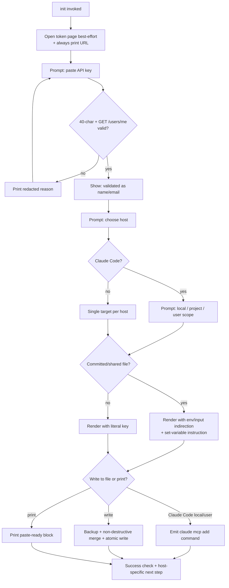

# feat: One-command guided installer (`npx … init`)

## Summary

Add an `init` subcommand to the existing published CLI that walks a non-developer through setup: open the Pipedrive API-token page, paste a key that is live-validated against their account, choose a target client and config scope, and receive a working MCP config (printed, and optionally written into the host's config file with a backup). The server's runtime, transport, tool surface, and single-token security model are unchanged — this is onboarding packaging over validation code that already exists.

---

## Problem Frame

Install today is "clone/npx + hand-paste a token into an `env` block" across hosts whose config formats differ and drift. For the sales audience this server targets, that manual-config cliff is a major near-term adoption barrier, and removing it is the cheapest near-term adoption win available without building hosted OAuth (idea #7, 80% confidence, ranked in `docs/private/2026-06-14-next-direction-ideation.html`). It is not a durable moat — a peer server could add the same command, and the ideation reserves the durable differentiator for the deferred hosted/OAuth path — and it is a forward bet: no install-funnel data yet isolates setup as the binding constraint over the competing ones the ideation names (the 91k-token per-session cost; discovery/trust against an unofficial server). The operator is the technically-comfortable end of that audience, or an admin setting sellers up — not a seller who never opens a terminal; the flow serves whoever runs `init`. The validation primitives (`validateConfig()`, the 40-char check, `GET /users/me`, token redaction) already exist; the work is wiring them into a guided flow and getting each host's config mechanics right.

---

## Requirements

### CLI surface and packaging

- R1. `npx @ckalima/pipedrive-mcp-server init` runs the guided installer; invoking the binary with no subcommand boots the STDIO server exactly as it does today.
- R2. The installer adds no new runtime dependency and no second published `bin` — it routes inside the existing entry point.

### Key validation

- R3. The installer attempts to open the Pipedrive API-token page and always prints the URL as a fallback (headless-safe).
- R4. A pasted key is validated for 40-character format and against a live `GET /users/me`, reusing the existing config validation and token-redaction code; on success the owning user's identity (name/email) is shown so the user can confirm the right account.
- R5. An invalid, malformed, or rejected key produces a clear, token-redacted message and re-prompts, never echoing or leaking the key into output or logs.

### Config generation

- R6. The installer emits a correct STDIO server config for Claude Desktop, Claude Code, Cursor, and Windsurf/VS Code, using each host's correct top-level key (`servers` for VS Code, `mcpServers` for the others) and config-file location per OS.
- R7. For Claude Code, the installer surfaces the local / project / user scope distinction and guides the user toward the right one for their situation.
- R8. A raw API key is never written into a shared or committed config file (Claude Code project `.mcp.json`, Cursor project `.cursor/mcp.json`, VS Code workspace `.vscode/mcp.json`); those targets use env-var / input indirection plus a follow-up instruction to set the variable.

### Config delivery

- R9. The installer always prints a paste-ready block, and additionally offers to write it into the detected host config file via a non-destructive merge (preserves sibling servers) after taking a timestamped backup.
- R10. For Claude Code local and user scope, the installer emits the `claude mcp add` command rather than editing `~/.claude.json` directly.

### Onboarding outcome

- R11. The flow ends with an explicit success check and the correct host-specific next step (restart the app / approve the project server / set the referenced env var).
- R12. The installer is scriptable: host, scope, and a print-only mode can be passed as flags so it runs without interactive prompts.

### Secret hygiene and safe writes

- R13. All error and validation output is redacted against the currently pasted key, passed explicitly — never the client's cached config token, which is null on the first un-cached attempt and stale after a re-prompt. A rejected, malformed, or network-failed key never echoes to the terminal or logs in any form (query-string or bare).
- R14. Every file the installer writes that may hold a literal key (the merged private config and any backup) is created owner-only (mode `0600`) via temp-file-then-rename, and a backup is never written inside a detected git working tree.
- R15. The key is never placed in a process argument vector: the Claude Code add path uses a non-argv form (a pre-set env var, or `add-json` reading the block from stdin), and the installer prints a one-line credential-exposure warning whenever its output or a written file carries a live key.
- R16. Child processes the installer spawns (browser open) receive an environment scrubbed of `PIPEDRIVE_API_KEY`.
- R17. `--host`/`--scope` combinations are validated against the host table and rejected fail-closed before any key is requested or rendered; writing a committed-target file inside a git working tree requires interactive confirmation.
- R18. The block printed to the terminal uses `${PIPEDRIVE_API_KEY}` (or the host's input/indirection form) by default, so a literal key never enters terminal scrollback; on the file-write path the literal key goes only to the `0600` file and the terminal shows the indirected block plus the written path. A literal key appears in the terminal only when the user chose print-only with no file target, and then with the credential-exposure warning.

---

## Key Technical Decisions

- KTD1 — `init` is an argv branch on the existing single `bin`, not a new binary. The no-subcommand path (`npx … `) preserves the current `main()` STDIO boot byte-for-byte, so the running-server contract is untouched and there is one published entry point to maintain. (see origin: `docs/private/2026-06-14-next-direction-ideation.html`, idea #7)

- KTD2 — Validate the pasted key with a token-accepting validation seam, not by mutating global config. The client has no per-request token path today: `getClient()` is a process-lifetime singleton that caches `this.config` from `getConfig()`/`process.env` on first use, and `applyAuth` reads only that cached key. A global `process.env` mutation would therefore bleed into spawned children and — because the cache is frozen on first use — would authenticate the entire re-prompt loop against the first (wrong) key. So U2 adds a narrow token-accepting seam (a `PipedriveClient` method, or a fresh instance built with the explicit key) that issues `GET /users/me` (v1) and redacts via `redactSecrets(msg, pastedKey)` with the current key. This sends each attempt's key on the wire, keeps the token out of `process.env` and child processes, and keys redaction off the pasted value rather than the stale cache. Reuse the request/redaction primitives; do not reuse the env-driven singleton. (see Sources & Research)

- KTD3 — Never expose a raw API key in a channel the user does not control end-to-end. Committed targets (Claude Code project, Cursor project, VS Code workspace) get `${PIPEDRIVE_API_KEY}` indirection (or VS Code's `${input:…}` secret prompt) and a "set this variable" follow-up; a literal key is written only into user-private files. The same rule extends past committed files to three other uncontrolled channels the installer keeps the literal key out of by construction: a process argument vector (shell history, `ps`) — the Claude Code add path uses a non-argv form; an in-tree backup — relocated out-of-tree or aborted; and terminal scrollback — the printed block is indirected, with a literal shown only under print-only-with-no-file plus a warning (R18). This is the load-bearing safety decision — it keeps the installer from manufacturing a leak. (see Sources & Research)

- KTD4 — Centralize all host-specific knowledge — config path per OS, top-level key, committed-vs-private flag, secret mechanism, and any CLI command — in one descriptor table. The documented maintenance risk is that host formats drift; a single table makes each drift a one-file edit and is where the non-obvious facts live (VS Code's `servers` key; Windsurf global-only).

- KTD5 — Config writes are read-merge-backup-write and never clobber. The installer parses any existing config, merges the new server under the correct top-level key without disturbing other entries, takes a backup, then writes atomically (temp-file-then-rename). A malformed existing file aborts the write and falls back to printing. Two secret-safety constraints ride on this: any file that may carry a literal key (the merged config and its backup) is created mode `0600`, and a backup is never placed inside a git working tree — back up out-of-tree or abort to print.

- KTD6 — Node built-ins only. Interactive prompts use `node:readline/promises`; browser open uses `child_process` with the platform opener (`open` / `start` / `xdg-open`); file IO uses `node:fs`. The URL is always printed *before* the open attempt and the opener is fire-and-forget (not awaited, or wrapped in a short timeout) so a hung opener on a locked-down/WSL/SSH machine never blocks the key prompt. The spawned opener gets an environment scrubbed of `PIPEDRIVE_API_KEY` so the token never enters a child process. No new dependency enters the bundle.

---

## High-Level Technical Design

The `init` flow is a short interactive state machine with three decision gates that change what gets produced: key validity (loop until valid or quit), whether the chosen target is a committed file (literal key vs. indirection), and write-vs-print. The flowchart below is directional guidance for the orchestration in U5, not an implementation spec.

---

## Implementation Units

### U1. `init` subcommand dispatch and CLI skeleton

- Goal: Route `init` (and `init --help`) to the installer while leaving the default no-arg path booting the STDIO server unchanged.
- Requirements: R1, R2, R12
- Dependencies: none
- Files: `src/index.ts` (modify — argv branch before `main()`), `src/cli/init.ts` (new — orchestrator entry `runInit(argv)`, stubbed), `tests/unit/cli-dispatch.test.ts` (new)
- Approach: At the `isEntrypoint()` block, inspect `process.argv[2]`. `"init"` → `await runInit(process.argv.slice(3))` then `process.exit`; anything falsy → existing `main()`; an unknown subcommand → print short usage to stderr and exit non-zero. The `init --help`/usage text is emitted from `src/cli/init.ts` and is owned by this unit; U6 only documents the command in the README (it does not re-implement help). Keep `handleCallTool`/`main` exports intact so existing tests are unaffected. Parse `--print-only`, `--host`, `--scope` flags here or in `runInit` for scriptability (R12).
- Patterns to follow: the existing `isEntrypoint()` guard and stderr-only logging convention in `src/index.ts`.
- Test scenarios:
  - `init` argv dispatches to the installer orchestrator (spy/mock `runInit`), not to `main()`.
  - No subcommand still invokes the server boot path.
  - Unknown subcommand (`frobnicate`) prints usage and exits non-zero without booting the server.
  - `--print-only` / `--host` / `--scope` flags are parsed into the orchestrator's options.
- Verification: `npx … init --help` prints usage; `npx … ` (no arg) still connects over STDIO; existing index tests pass unchanged.

### U2. Reusable pasted-key validation (format + live identity)

- Goal: Validate an arbitrary pasted key (not just the env value) and return the owning user's identity, reusing existing validation and redaction.
- Requirements: R4, R5, R13
- Dependencies: U1
- Files: `src/config.ts` (modify — export a shared `API_KEY_LENGTH` constant and an `isValidApiKeyFormat(key)` helper so the installer and `getConfig()` cannot drift), `src/client.ts` (modify — add a token-accepting validation seam that issues `GET /users/me` with an explicitly-passed key instead of reading `process.env`; the buildable route is an optional constructor/config-seed param, since `ensureInitialized()` unconditionally calls `getConfig()` when `this.config` is null — a seeded fresh instance must supply all four `Config` fields and deliberately bypasses `getConfig()`'s redaction cache), `src/cli/verify-key.ts` (new — `verifyApiKey(key): Promise<{ valid: boolean; user?: { name?: string; email?: string }; error?: string }>`), `tests/unit/verify-key.test.ts` (new)
- Approach: `verifyApiKey` checks format via the shared helper, then issues `GET /users/me` (v1) through the token-accepting seam (KTD2) so each attempt authenticates with the *current* pasted key — not the singleton's frozen config, which would re-validate the whole re-prompt loop against the first key. It reads `name`/`email` from the response data on success and redacts every returned message via `redactSecrets(message, pastedKey)` with the current key (the `redactSecrets` signature in `src/utils/errors.ts` already accepts an explicit secret). The validation call goes straight to the client's `GET /users/me` (v1) and must bypass the version-routing seam: `/users/me` is registered there as a collection root whose 404 the seam treats as a retirement signal, which validation traffic must not trip.
- Patterns to follow: `validateConfig()`'s non-throwing result shape in `src/config.ts`; `redactSecrets(value, knownSecret)` in `src/utils/errors.ts`; the existing `applyAuth`/`get` request path in `src/client.ts`.
- Test scenarios:
  - 39- and 41-char keys fail format with no network call made.
  - Valid key + mocked 200 returns `valid: true` and the parsed name/email.
  - Mocked 401 returns `valid: false` with a friendly, token-free message.
  - Re-prompt with a *different* valid key authenticates against the new key on the wire (the token-accepting seam sends the current key), not a cached first key.
  - First attempt with no prior config cached: a network error still has the pasted key fully redacted (redaction does not depend on `this.config`).
  - A 401 body (or error) reflecting the *bare* 40-char key — not the `?api_token=` query form — is redacted: no substring of the current key survives any returned message.
  - The shared `isValidApiKeyFormat` is the same predicate `getConfig()` enforces (length parity test).
- Verification: pasting a known-good test key prints the matching account identity; a corrected key after a wrong first paste validates against the corrected key; across first-attempt, re-prompt, and bare-key-in-body paths, no substring of the key appears in any output string.

### U3. Host config descriptor table and renderer

- Goal: Produce the correct config artifact (JSON block or CLI command) for each supported host/scope, with host-correct keys and secret handling.
- Requirements: R6, R7, R8
- Dependencies: U2
- Files: `src/cli/config-targets.ts` (new — descriptor table + `renderConfig(host, scope, key)`), `tests/unit/config-targets.test.ts` (new)
- Approach: A descriptor per host carries: display name, config path per OS, top-level key (`servers` for VS Code, else `mcpServers`), whether the target file is committed/shared, the secret mechanism (literal / `${PIPEDRIVE_API_KEY}` / VS Code `${input:…}` + `inputs` array / `claude mcp add`), and OS-path resolution. Land the verified hosts (Claude Desktop, Claude Code) first; add Cursor and Windsurf/VS Code as each descriptor clears the verification gate below (Delivery sequencing). `renderConfig` selects literal vs. indirection from the committed flag (KTD3) and emits the server block keyed on the correct top-level name. Encodes the standard server shape: `command: "npx"`, `args: ["-y", "@ckalima/pipedrive-mcp-server"]`, env carrying the key or its reference.
- Patterns to follow: the canonical config block in `README.md` lines 41-53; mirror its `command`/`args`/`env` shape.
- Test scenarios:
  - Each host renders the correct top-level key — VS Code emits `servers` and the `inputs` array; the rest emit `mcpServers`.
  - Committed targets (Claude Code project, Cursor project, VS Code workspace) never contain the raw key in their rendered output (substring assertion); a private target (Claude Desktop, Windsurf) does.
  - Claude Code project scope renders `${PIPEDRIVE_API_KEY}`; VS Code renders `${input:…}` with a `password: true` input.
  - OS path resolution returns the documented macOS/Windows paths for Claude Desktop and the Windows path is absent (or flagged) for Linux.
  - Each descriptor's rendered output matches a captured fixture confirmed against the live host (so a wrong path/key value fails a test instead of shipping silently — mocked rendering alone would pass on wrong data).
- Verification: rendered blocks paste cleanly into each host and load the server; no committed-file rendering carries a literal key. **Blocking gate:** the items flagged unverified in Sources & Research (VS Code user-scope path, Windsurf `${env:…}`, Cursor `envFile`, `claude mcp add-json` stdin) are confirmed against the live host or current official docs before their descriptor values are committed — R6 ("correct config") is not met for a host until its descriptor is verified.

### U4. Non-destructive config writer

- Goal: Write a rendered config into a host file safely (merge + backup + atomic, owner-only mode), or emit a Claude Code add command that keeps the key out of argv.
- Requirements: R9, R10, R14, R15
- Dependencies: U3
- Files: `src/cli/write-config.ts` (new — `writeConfig(target, rendered)` and `claudeMcpAddInvocation(scope)`), `tests/unit/write-config.test.ts` (new)
- Approach: U3 renders the artifact; U4 either writes the file form or — for Claude Code local/user scope — wraps the rendered block into the no-argv command. For file targets, read existing JSON if present, merge the new server under the correct top-level key without disturbing siblings, then write atomically (temp + rename). Mode `0600` is set on the temp file before rename *regardless of whether the destination pre-existed*, so merging into a previously world-readable (`0644`) file tightens it rather than preserving the loose mode (KTD5). The backup is `<file>.bak-<timestamp>`, but never inside a detected git working tree: when the target resolves in-tree, back up to an out-of-tree location (OS temp/state dir) and print that path so the user can delete it, or abort to print. A missing file creates a fresh one with parent dirs; a malformed existing file aborts and signals fallback-to-print. For Claude Code local/user scope, return an invocation that does not place the key in argv (a pre-set env var the command references, or `add-json` fed via stdin) rather than `--env PIPEDRIVE_API_KEY=<literal>`, and never edit `~/.claude.json` directly; if the `claude` CLI is absent, fall back to printing (not to a literal `--env` argv that would violate R15).
- Patterns to follow: existing `node:fs`/`node:path` usage (`resolve` in `src/config.ts`).
- Test scenarios:
  - Writing into a file with an existing unrelated server preserves that server and adds ours.
  - A backup is created before the write and matches the pre-write contents.
  - Secret-bearing files (merged private config and backup) are created with mode `0600` (stat assertion).
  - Merging into a pre-existing mode-`0644` file yields a mode-`0600` result (the write tightens, not preserves, permissions).
  - When the target resolves inside a git working tree, no `.bak` is written into the tree (it lands out-of-tree with its path printed, or the write aborts to print).
  - When the `claude` CLI is absent, the Claude Code local/user path falls back to printing — never to a literal `--env <key>` command.
  - Missing file path creates the file (and parent dir) with only our server, mode `0600`.
  - Malformed existing JSON: original is left byte-for-byte unchanged and the function reports a fallback-to-print outcome.
  - Re-running does not duplicate the server entry (idempotent merge on the same name).
  - `claudeMcpAddInvocation` produces a valid command whose argv contains no substring of the key (substring assertion).
- Verification: writing to a populated Claude Desktop config leaves other servers intact with a recoverable `0600` backup; re-running is idempotent; no secret-bearing artifact is world-readable or left in a git tree.

### U5. Interactive flow orchestration and browser open

- Goal: Wire the end-to-end guided experience: validate flags, open page, prompt + validate, choose host/scope, render, write or print, success check.
- Requirements: R3, R5, R7, R11, R12, R15, R16, R17, R18
- Dependencies: U2, U3, U4
- Files: `src/cli/init.ts` (modify — implement `runInit`), `src/cli/open-url.ts` (new — best-effort cross-platform opener), `tests/unit/init-flow.test.ts` (new)
- Approach: Validate any `--host`/`--scope` flags against the host table and reject illegal combinations fail-closed *before* requesting or rendering a key (R17) — the host/scope choice is what drives literal-vs-indirection, so an invalid combo must never silently route a secret into the wrong rendering. Use `node:readline/promises` for prompts. Print the token-page URL, then attempt to open it (fire-and-forget, env scrubbed of the key per R16 and KTD6) so a hung opener never blocks the prompt (R3). Loop key entry through `verifyApiKey` until valid or the user quits (R5). Prompt host, then Claude Code scope when applicable (R7). Render (U3) with `${PIPEDRIVE_API_KEY}` indirection for anything printed to the terminal so the literal key never enters scrollback; on the file-write path the literal key goes only to the `0600` file and the terminal shows the indirected block plus the written path (R18). Offer write vs print (U4); before writing a committed-target file inside a git tree, confirm intent (R17). Show a literal-key block in the terminal only under `--print-only` with no file target, and then with the credential-exposure warning (R15). Honor `--print-only`/`--host`/`--scope` to skip matching prompts (R12). End with the host-specific success message and next step (R11). Inject readline, opener, validator, and writer as seams so the flow is testable without real IO.
- Execution note: Start with a failing integration test for the happy-path flow contract (mocked seams) before wiring real readline/spawn.
- Patterns to follow: dependency-injection style used by the extracted `handleCallTool` in `src/index.ts` (importable/testable without the transport).
- Test scenarios:
  - Happy path: valid key + chosen host + write → calls the writer with the expected target and prints the success step (all seams mocked).
  - Invalid-then-valid key re-prompts once, then proceeds.
  - Browser-open failure (opener throws) still prints the URL and continues.
  - An opener that hangs (never resolves) does not block the key prompt (the URL was printed first and the open is not awaited).
  - The spawned opener receives an `env` with no `PIPEDRIVE_API_KEY` (passed-env assertion).
  - The default print path (with a file target) shows the indirected block plus the written path — no substring of the key appears in stdout.
  - A literal-key block appears only under `--print-only` with no file target, and then the credential-exposure warning is printed.
  - An illegal `--host`/`--scope` combo is rejected before any key prompt (fail-closed).
  - Writing a committed-target file inside a git tree prompts for confirmation; declining falls back to print.
  - Claude Code host triggers the scope prompt; non-Claude-Code hosts do not.
- Verification: a real `npx … init` run completes a paste-or-write setup against a live account, prints a green success check, and surfaces the credential warning whenever a literal key is shown.

### U6. Docs, help text, and packaging

- Goal: Document the one-command path and ensure it ships.
- Requirements: R1, R11
- Dependencies: U1, U5
- Files: `README.md` (modify — add a "Fastest setup: `npx … init`" callout above the manual Quick Start), `package.json` (verify `files`/`bin` ship `dist/cli/**`). The `init --help` output itself is implemented in U1's `src/cli/init.ts`; this unit documents the command, it does not re-implement help.
- Approach: Add a short README section leading with `npx -y @ckalima/pipedrive-mcp-server init` and a one-line description, keeping the existing manual block as the fallback. Confirm `dist` (already in `files`) covers the compiled `cli/` output and the existing `bin` resolves the new path. Verify `npm run gen:docs` is unaffected (the installer adds no MCP tools, so the README tool table and manifest are unchanged).
- Patterns to follow: the Quick Start structure in `README.md` lines 29-67.
- Test scenarios: none — documentation and packaging. Test expectation: none — no behavioral change beyond help-text output already covered by U1.
- Verification: README renders the new section; `npm pack` includes `dist/cli/`; `gen:docs` reports no drift.

---

## Scope Boundaries

In scope: an `init` subcommand that validates a pasted key and delivers host config for Claude Desktop, Claude Code (local/project/user), Cursor, and Windsurf/VS Code, by printing and optionally writing with a backup.

Delivery sequencing: the fully-verified hosts (Claude Desktop, Claude Code) ship in the first cut; Cursor and Windsurf/VS Code land in the same units once their flagged descriptors (Sources & Research) clear the U3 verification gate. No scope is dropped — coverage is sequenced by verification readiness, which also keeps each PR's review surface smaller.

Out of scope (unchanged by this work):

- The running server's transport, tool surface, error handling, and resilience.
- The single-personal-token security model. The installer reduces setup friction; it does not add scopes or OAuth (that is idea #6, explicitly deferred for the key-centralization conflict).

### Deferred to Follow-Up Work

- Idea #4 (server-enforced capability modes: read-only / safe-write / full) — a separate plan, to be written next in a distinct `ce-plan` run.
- Masked key entry (no terminal echo) — a UX nicety; the literal key already lands in config files, so masking input is low-marginal-value. Revisit if requested.
- Auto-detecting which hosts are installed on the machine and pre-selecting — the table supports it later; the first version asks.

---

## Open Questions

- Exact Pipedrive API-token page URL. The canonical entry is `https://app.pipedrive.com/settings/api`, which redirects to the user's company subdomain — verify the redirect behavior (and that the destination carries no session token in its query string) at implementation before hardcoding; opening only the base URL and letting the browser redirect avoids capturing any SSO artifact (the README directs users via Settings > Personal preferences > API).
- Host descriptors flagged unverified in Sources & Research (VS Code user-scope path, Windsurf `${env:…}`, Cursor `envFile`, `claude mcp add-json` stdin) must be confirmed against a live host before their values are committed — this is the U3 blocking gate, and it gates which hosts ship in the first cut (Delivery sequencing).

---

## Risks & Dependencies

- Host config formats drift over time (the feature's main maintenance risk, per the ideation), and the unit tests assert against the descriptor table itself — so a wrong path/key value renders "correctly" and ships invisibly. Mitigated by KTD4's single descriptor table, the U3 blocking verification gate plus captured-fixture check, and the re-verify list in Sources & Research. No drift breaks the print path — only the host-specific accuracy.
- Editing user-owned files risks corrupting an existing config. Mitigated by KTD5 (backup + non-destructive merge + abort-on-malformed) and KTD3 (never write a secret into a shared file).
- Cross-platform `spawn`/path differences for browser open and config locations. Mitigated by best-effort open with printed-URL fallback (KTD6) and per-OS paths in the descriptor table.
- The installer can *manufacture* new credential-exposure artifacts the running server never creates: a plaintext backup, the key in shell history via a command-line `--env`, the key in spawned-child env, and the key in terminal scrollback. This is the dominant security risk and is contained by R13-R18 (redact against the pasted key, `0600` + no in-tree backup, no key in argv, scrubbed child env, indirected terminal output, exposure warning) and broadened KTD3. None of these change the underlying single-token model — they prevent setup from leaking the token the model still relies on.

---

## Sources & Research

Host MCP-config mechanics verified against primary docs (2026) — the breadcrumbs U3/U4 build on. Treat the flagged items as verify-before-hardcode.

| Host | Config path(s) | Top-level key | Committed/shared? | Secret handling |
|---|---|---|---|---|
| Claude Code — local | `~/.claude.json` (per-project) | n/a (CLI) | No | `claude mcp add` `--env`; prefer command over file edit |
| Claude Code — project | `.mcp.json` (repo root) | `mcpServers` | Yes | `${PIPEDRIVE_API_KEY}` expansion; never literal |
| Claude Code — user | `~/.claude.json` (top level) | n/a (CLI) | No | `claude mcp add --scope user` |
| Claude Desktop | macOS `~/Library/Application Support/Claude/claude_desktop_config.json`; Windows `%APPDATA%\Claude\claude_desktop_config.json`; Linux unsupported | `mcpServers` | No (user-private) | literal key (plaintext on disk) |
| Cursor | global `~/.cursor/mcp.json`; project `.cursor/mcp.json` | `mcpServers` | Project file can be committed | `envFile` or literal; gitignore project file |
| Windsurf | `~/.codeium/windsurf/mcp_config.json` (global only) | `mcpServers` | No (user-private) | `${env:VAR}` interpolation or literal |
| VS Code (Copilot agent) | workspace `.vscode/mcp.json`; user `mcp.json` | **`servers`** (not `mcpServers`) | Workspace file can be committed | `inputs` (`promptString`, `password: true`) + `${input:id}`, or `envFile` |

- Claude Code MCP config and scopes: https://code.claude.com/docs/en/mcp — `claude mcp add` requires the `--` separator for stdio; `claude mcp add-json` accepts a raw JSON block; `${VAR}` / `${VAR:-default}` expansion supported; `envFile` for `.mcp.json` is an open feature request, not shipped.
- Claude Desktop local servers: https://modelcontextprotocol.io/docs/develop/connect-local-servers
- Cursor MCP: https://cursor.com/docs/mcp
- Windsurf (docs migrated to Devin/Cognition): https://docs.devin.ai/desktop/cascade/mcp
- VS Code MCP configuration: https://code.visualstudio.com/docs/agents/reference/mcp-configuration
- Reuse seams in this repo: `validateConfig()` and the 40-char check in `src/config.ts`; `testConnection()` (`GET /users/me`, v1) in `src/client.ts`; the canonical config block in `README.md` lines 41-53.
- Redaction-keying constraint behind KTD2/R13: `redactSecrets(value, knownSecret)` in `src/utils/errors.ts` (lines 69-92) strips reliably only the secret it is *handed*; the client's call sites pass `this.config?.apiKey` (`src/client.ts` lines 175, 503, 536), and `getConfig()` caches that token on first use (`src/config.ts` lines 38-63). The installer therefore must hand `redactSecrets` the currently pasted key, not rely on the cached config.

Flagged unverified (re-check before hardcoding): VS Code user-scope `mcp.json` path; Windsurf `${env:…}` interpolation post-docs-migration; Cursor `envFile` field; the Pipedrive token-page redirect.
