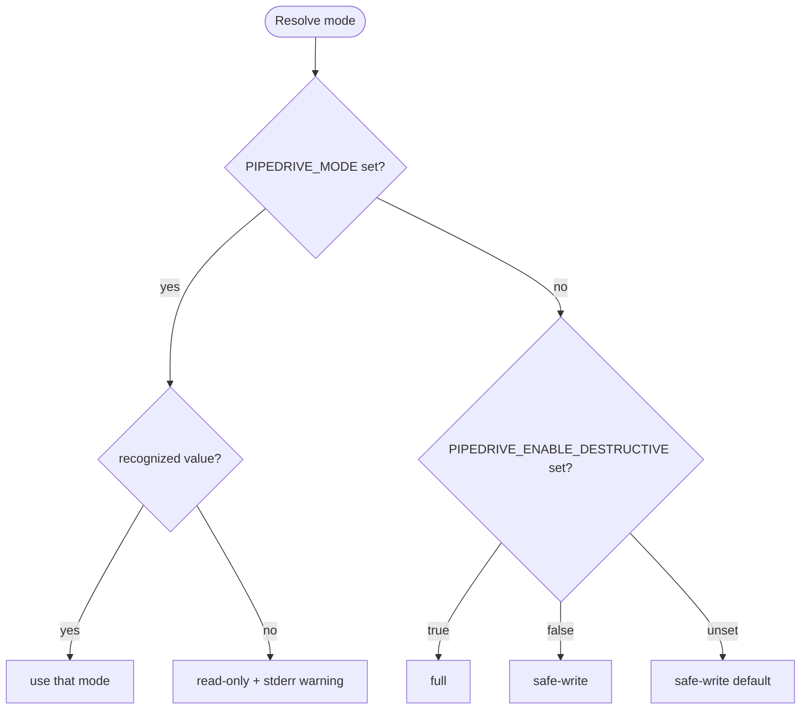
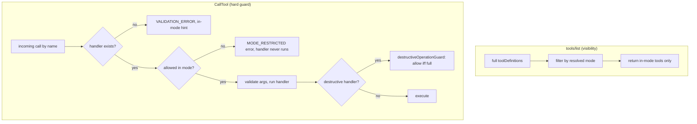

# feat: Server-enforced capability modes (read-only / safe-write / full)

## Summary

Add a `PIPEDRIVE_MODE` environment variable — `read-only`, `safe-write`, or `full` — that governs which Pipedrive tools an agent can reach. The mode is enforced two ways: disallowed tools are filtered out of `tools/list` (so the agent never sees them), and a dispatcher backstop refuses any out-of-mode call by name even if a client invokes it directly. The three tiers map onto metadata the server already derives per tool (read/write from the verb prefix, destructive from the declared `destructive` field), so no new per-tool data is introduced. Resolution is backward-compatible: `PIPEDRIVE_MODE` is authoritative when set, otherwise the mode is derived from today's `PIPEDRIVE_ENABLE_DESTRUCTIVE` flag, and the unset default (`safe-write`) reproduces the server's current out-of-box behavior exactly.

---

## Problem Frame

Today the server has a single coarse safety lever: `PIPEDRIVE_ENABLE_DESTRUCTIVE` (a boolean that gates 31 delete/convert tools). There is no way to run the server **read-only** (the "let the agent look but not touch" posture), and no tier between "reads plus all non-destructive writes" and "everything including deletes." A read-only posture is simply impossible today, and a single boolean is a coarse lever for an `api_token` that already carries the full owning-user permissions, so the server is the only place a finer gradation can be enforced. The ideation judges read-only the most-wanted of these gradations (idea #4, 85% confidence, ranked in `docs/private/2026-06-14-next-direction-ideation.html`), though that demand is an inference from the Close CRM precedent and maintainer judgment rather than a measured signal; the capability gap alone justifies the work.

The enabling insight is that the metadata to drive tiering already exists and is test-locked: `verbSemantics()` classifies every tool read-vs-write from its `pipedrive_<verb>_…` name (exhaustive verb coverage enforced in `tests/unit/tool-annotations.test.ts`), and the declared `destructive` field — the same field that gates `destructiveOperationGuard()` and the README 🔒 marker — identifies the irreversible writes (kept honest by the static field↔guard scan in `tests/unit/gen-docs.test.ts`). This plan turns that classification from a passive hint into an enforced guarantee. It is contained, additive work with a clear backward-compatibility story, not a transport or auth change.

---

## Requirements

### Modes and resolution

- R1. A `PIPEDRIVE_MODE` environment variable selects exactly one of `read-only`, `safe-write`, or `full`.
- R2. `PIPEDRIVE_MODE` is authoritative when set. When it is unset, the mode is derived from `PIPEDRIVE_ENABLE_DESTRUCTIVE` (`true` → `full`, `false`/unset → `safe-write`). When neither variable is set, the mode is `safe-write`, matching today's out-of-box behavior exactly.
- R3. An unrecognized `PIPEDRIVE_MODE` value resolves fail-closed to `read-only` (never to a more permissive tier) and surfaces a clear stderr warning naming the valid values.

### Tool-tier classification

- R4. Each tool's minimum required mode is derived from existing metadata: read-only-verb tools are available in every mode; non-destructive writes require `safe-write` or higher; `destructive` tools require `full`. No new per-tool metadata is added, and classification stays consistent with `buildToolAnnotations`.

### Enforcement: hide + guard backstop

- R5. `tools/list` exposes only the tools available in the resolved mode (`read-only` → 69, `safe-write` → 124, `full` → 155).
- R6. A call to a tool not available in the resolved mode is rejected before its handler runs (the handler never executes), with a clear mode-named error under a distinct error code.
- R6a. The unknown-tool error hint enumerates only tools available in the resolved mode, so a restricted-mode caller cannot discover hidden tool names by probing an invalid name. This is a testable enforcement control, not optional polish.
- R7. The exported full registry (`allTools`, `toolDefinitions`) is left unchanged; filtering is additive, so existing registry invariants and counts (155 tools, annotations coverage) continue to hold.

### Reconcile the destructive gate

- R8. Destructive operations are permitted if and only if the resolved mode is `full`. The runtime destructive guard honors the resolved mode, so `PIPEDRIVE_MODE=full` enables destructive ops and the guard can never disagree with the dispatcher backstop, while `PIPEDRIVE_ENABLE_DESTRUCTIVE=true` continues to work through the resolution mapping.

### Observability and backward-compat messaging

- R9. At startup the server logs the resolved mode to stderr, and when the mode was derived from `PIPEDRIVE_ENABLE_DESTRUCTIVE` (i.e. `PIPEDRIVE_MODE` was unset), it emits a one-time deprecation notice pointing operators to `PIPEDRIVE_MODE`.

### Documentation and manifest

- R10. The README environment-variable table, the generated tool-table legend, and a new capability-modes section document the three modes; the MCPB manifest surfaces `PIPEDRIVE_MODE` so the bundle install UI can set it. `npm run gen:docs` reproduces every generated region with no CI drift.

### Test isolation

- R11. The global test baseline clears `PIPEDRIVE_MODE` and `PIPEDRIVE_ENABLE_DESTRUCTIVE` before each test so mode resolution is deterministic regardless of the developer's shell environment; suites that call `setupValidEnv()` continue to run in `full` mode.

---

## High-Level Technical Design

Two flows define the feature: how an environment resolves to a mode, and how that mode is enforced at list-time and call-time.

### Mode resolution (precedence)

### Two-layer enforcement

The list filter is the UX/token layer (the agent simply doesn't see out-of-mode tools); the dispatcher backstop is the hard guarantee (a client that calls a hidden tool by name is refused before the handler runs); `destructiveOperationGuard()` becomes the innermost, defense-in-depth layer that must agree with the resolved mode.

### Mode → surface mapping

| Mode | What's available | Tool count | Destructive ops |
|------|------------------|-----------:|-----------------|
| `read-only` | read verbs only (`list`/`get`/`search`) | 69 | no |
| `safe-write` | reads + non-destructive writes | 124 | no |
| `full` | all tools | 155 | yes |

Counts are the live registry today (69 reads / 86 writes / 31 destructive, locked in `tests/unit/tool-annotations.test.ts`); test scenarios assert them so the surface cannot drift silently.

`safe-write` admits every write that is **not** flagged `destructive`. That includes a few writes which are irreversible in practice but not currently flagged destructive, notably `pipedrive_convert_lead_to_deal` (a successful conversion consumes the source lead) and `pipedrive_archive_project`. They ride in `safe-write` today by inheriting their existing classification; whether they should be reclassified into `full` is captured under Open Questions.

---

## Key Technical Decisions

- KTD1. **Reuse existing classification; add no per-tool metadata.** Tiering derives from `verbSemantics(tool.name).readOnly` (read vs write) and `tool.destructive` (the declared field). This is the same source `buildToolAnnotations` uses, so the mode tiers can never disagree with the published annotations, and the existing exhaustive-verb and destructive↔guard tests already protect the inputs.
- KTD2. **Backward-compatible resolution with `PIPEDRIVE_MODE` primary.** Unset `PIPEDRIVE_MODE` derives from `PIPEDRIVE_ENABLE_DESTRUCTIVE` (`true`→full, `false`→safe-write); both unset defaults to `safe-write`. This is exact behavior-preservation: today's no-env default is "reads + non-destructive writes," which *is* `safe-write`, and today's `ENABLE_DESTRUCTIVE=true` *is* `full`. No existing install changes behavior on upgrade. (Confirmed with the requester.)
- KTD3. **Two-layer enforcement (hide + backstop), without mutating the exported registry.** `tools/list` is filtered for visibility and token cost; the dispatcher independently refuses out-of-mode calls so hiding is never the only guard. The exported `toolDefinitions`/`allTools` stay the full 155 set; filtering happens through a pure helper applied at the list and call boundaries, preserving every existing registry invariant.
- KTD4. **Invalid mode fails closed to `read-only`.** A typo'd or unknown `PIPEDRIVE_MODE` must never grant more access than intended, so it resolves to the safest tier with a loud warning (fail-closed), rather than failing open to a write tier or hard-crashing the server. This mirrors the deny-by-default posture of `PIPEDRIVE_IMAGE_BASE_DIR` and `PIPEDRIVE_ENABLE_DESTRUCTIVE`.
- KTD5. **The destructive guard becomes mode-aware — this is correctness, not polish.** If the guard kept reading only `PIPEDRIVE_ENABLE_DESTRUCTIVE`, then `PIPEDRIVE_MODE=full` (with the legacy flag unset) would let the dispatcher admit a destructive tool while the in-handler guard rejected it — destructive ops broken in `full` mode. The guard must allow iff the resolved mode is `full`.
- KTD6. **Core logic lives in a new `src/capability-modes.ts`; `index.ts` stays thin.** `src/index.ts` and `src/tools/index.ts` are coverage-excluded, so all testable logic (resolution, classification, filtering, startup messaging) goes in the new module (coverage-counted, pure). `errors.ts` imports the resolver from `capability-modes.ts`, **not** `config.ts`, to avoid adding the `errors.ts → config.ts` dependency the codebase deliberately avoids.
- KTD7. **A distinct `MODE_RESTRICTED` error code.** Separate from `DESTRUCTIVE_DISABLED` so the model and stderr telemetry can tell "blocked by the active capability tier" apart from "destructive specifically disabled," consistent with how `CIRCUIT_OPEN` was split from `RATE_LIMITED`.

---

## Implementation Units

### U1. Capability-mode core: type, resolution, classification

**Goal:** A single pure module that defines the mode type, resolves the mode from the environment, and classifies whether a tool is allowed in a mode. This is the linchpin everything else depends on.

**Requirements:** R1, R2, R3, R4, R11

**Dependencies:** none

**Files:**
- `src/capability-modes.ts` (new)
- `tests/unit/capability-modes.test.ts` (new)
- `tests/setup.ts` (modify — clear `PIPEDRIVE_MODE` and `PIPEDRIVE_ENABLE_DESTRUCTIVE` in `beforeEach`)

**Approach:** Export a `CapabilityMode` union (`"read-only" | "safe-write" | "full"`) and a `CAPABILITY_MODES` tuple. `resolveCapabilityMode(env = process.env)` is pure and side-effect-free: it implements the KTD2 precedence and the KTD4 fail-closed-to-`read-only` rule (normalize the `PIPEDRIVE_MODE` value with trim + lowercase, then exact-match the known set). Match `PIPEDRIVE_ENABLE_DESTRUCTIVE` with the same strict `=== "true"` comparison `getConfig()` already uses, so the derivation cannot silently widen access for an uppercase `TRUE`. `isToolAllowedInMode(tool, mode)` is pure and uses `verbSemantics(tool.name).readOnly` plus `tool.destructive`: read tools allowed in all modes, non-destructive writes in `safe-write`/`full`, destructive only in `full`. It treats a missing or undefined `tool` as allowed (a fall-through), so a caller that resolves a name with no registry entry never throws (see U4). Import `verbSemantics` from `src/tools/annotations.ts`. Keep all startup-message string construction in a separate pure helper (U5) so this module emits nothing.

**Patterns to follow:** `src/tools/annotations.ts` (pure, derived-from-metadata module with a co-located exhaustive test); the env-reading style of `getConfig()` in `src/config.ts`.

**Test scenarios:**
- Resolution, `PIPEDRIVE_MODE` set: each of `read-only` / `safe-write` / `full` → that mode.
- Precedence: `PIPEDRIVE_MODE=read-only` with `PIPEDRIVE_ENABLE_DESTRUCTIVE=true` → `read-only` (mode wins).
- Derivation, `PIPEDRIVE_MODE` unset: `ENABLE_DESTRUCTIVE=true` → `full`; `=false` → `safe-write`; unset → `safe-write`.
- Both unset → `safe-write`.
- Invalid value (`readonly`, `FULL ` with stray space handled by normalize vs. truly unknown like `garbage`, empty string) → `read-only`; confirm normalization accepts case/whitespace variants of valid values.
- Purity: `resolveCapabilityMode` does not mutate the passed env object.
- Classification against the live `allTools`: `read-only` allows exactly the 69 read tools and zero writes; `safe-write` allows exactly 124 (excludes all 31 destructive, includes every read); `full` allows all 155. Assert no destructive tool is allowed below `full`, and every read tool is allowed in `read-only`.
- `isToolAllowedInMode` pure cases: `{name:'pipedrive_get_x'}` allowed in all three; `{name:'pipedrive_create_x'}` allowed in `safe-write`/`full`, denied in `read-only`; `{name:'pipedrive_delete_x', destructive:true}` allowed only in `full`.
- Test-isolation: after the `tests/setup.ts` change, a test that sets `PIPEDRIVE_MODE` does not leak into the next test (resolution returns the default when neither var is set).
- Comparison parity: `PIPEDRIVE_ENABLE_DESTRUCTIVE=TRUE` (uppercase) with `PIPEDRIVE_MODE` unset resolves to `safe-write`, not `full`, matching `getConfig()`'s strict `=== "true"`.
- Undefined tool: `isToolAllowedInMode(undefined, mode)` returns `true` for every mode (the dispatcher relies on this fall-through; see U4).

**Verification:** `npm test` passes the new unit file; the live-registry counts (69 / 124 / 155) are asserted and green; `tsc` and `lint` clean.

### U2. Make the destructive gate and config mode-aware

**Goal:** Reconcile the existing `destructiveOperationGuard()` and `Config` with the resolved mode so `full` is the single source of "destructive allowed" (KTD5).

**Requirements:** R8

**Dependencies:** U1

**Files:**
- `src/utils/errors.ts` (modify `destructiveOperationGuard`)
- `src/config.ts` (modify `getConfig` to add `mode`)
- `tests/unit/errors.test.ts` (modify/extend — locate the existing guard tests)
- `tests/unit/config.test.ts` (modify/extend — locate the existing config tests)

**Approach:** `destructiveOperationGuard()` calls `resolveCapabilityMode()` and returns `null` (allowed) iff the mode is `full`, otherwise the existing `DESTRUCTIVE_DISABLED` error. Update the suggestion text to name `PIPEDRIVE_MODE=full` while retaining the `PIPEDRIVE_ENABLE_DESTRUCTIVE=true` hint for back-compat. `errors.ts` imports `resolveCapabilityMode` from `src/capability-modes.ts` (never `config.ts`). Add `mode: resolveCapabilityMode()` to the `Config` interface and the `getConfig()` return (`config.ts → capability-modes.ts` is acceptable), and derive the existing `enableDestructive` field from the resolved mode (`enableDestructive: mode === "full"`) instead of reading the raw flag, so the two `Config` fields can never disagree under `PIPEDRIVE_MODE=full` with the legacy flag unset.

**Patterns to follow:** the current `destructiveOperationGuard()` shape and the `redactSecrets` comment in `errors.ts` documenting the no-`config.ts`-dependency rule.

**Test scenarios:**
- Guard returns `null` in `full` reached via `PIPEDRIVE_MODE=full`, and via `PIPEDRIVE_ENABLE_DESTRUCTIVE=true` with `PIPEDRIVE_MODE` unset (back-compat).
- Guard returns a `DESTRUCTIVE_DISABLED` error in `safe-write` and in `read-only`.
- `getConfig().mode` reflects the resolved mode across the precedence matrix; an invalid `PIPEDRIVE_MODE` yields `read-only`.
- `getConfig().enableDestructive` agrees with the mode: `true` only when the resolved mode is `full` (including `PIPEDRIVE_MODE=full` with the legacy flag unset), `false` in `safe-write`/`read-only`.
- Regression: existing guard tests still pass — those that rely on `setupValidEnv()` now resolve to `full` and remain allowed.

**Verification:** existing destructive-guard tests pass unchanged in intent; new mode-aware cases green; no `errors.ts → config.ts` import introduced.

### U3. Filter `tools/list` to the active mode

**Goal:** `tools/list` returns only the tools available in the resolved mode, without mutating the exported registry (R5, R7).

**Requirements:** R5, R7

**Dependencies:** U1, U2 (U2 must land with the enforcement units — see Risks & Dependencies)

**Files:**
- `src/capability-modes.ts` (modify — add `filterToolDefinitionsForMode(defs, mode)`)
- `src/index.ts` (modify the `ListToolsRequestSchema` handler)
- `tests/integration/` (new or extend — e.g. `tests/integration/capability-modes.test.ts`)

**Approach:** Add a pure `filterToolDefinitionsForMode(defs, mode)` that keeps each definition whose classification is allowed in the mode. Because `toolDefinitions` entries carry MCP `annotations` (`readOnlyHint`/`destructiveHint`) rather than the raw `destructive` field, adapt each definition into the `{ name, destructive }` shape via `destructive ← annotations.destructiveHint` and reuse `isToolAllowedInMode` — one predicate, so list and dispatch agree. The `ListTools` handler calls `filterToolDefinitionsForMode(toolDefinitions, resolveCapabilityMode())` and returns that. Do **not** change the exported `toolDefinitions` constant. Test the pure filter directly (the inline handler is in coverage-excluded `index.ts`).

**Patterns to follow:** `toolDefinitions = allTools.map(...)` in `src/tools/index.ts`; the call-time env reads in `destructiveOperationGuard()`.

**Test scenarios:**
- `filterToolDefinitionsForMode(toolDefinitions, 'read-only').length === 69`; `'safe-write' === 124`; `'full' === 155`.
- Every definition in the `read-only` result has `annotations.readOnlyHint === true`; no definition in the `safe-write` result has `annotations.destructiveHint === true`; the `full` result equals `toolDefinitions`.
- Invariant: the exported `toolDefinitions.length` is still 155 after this change (registry unchanged).
- A specific destructive tool (`pipedrive_delete_lead`) is absent from `read-only` and `safe-write` results, present in `full`; a read tool (`pipedrive_get_deal`) is present in all three.
- Cross-check (list and dispatch agree): for all 155 tools across all three modes, membership in `filterToolDefinitionsForMode(toolDefinitions, mode)` equals `isToolAllowedInMode(getTool(name), mode)`, so the visibility layer (sourced from `annotations.destructiveHint`) and the dispatch backstop (sourced from `tool.destructive`) can never diverge on a future tool whose annotation and field disagree.

**Verification:** new integration assertions green; `tests/unit/tool-annotations.test.ts` (asserts `toolDefinitions.length === allTools.length === 155`) still passes.

### U4. Dispatcher backstop: reject out-of-mode calls

**Goal:** Refuse any tool call not allowed in the resolved mode before the handler runs, with a clear `MODE_RESTRICTED` error, and scope the unknown-tool hint to in-mode tools (R6).

**Requirements:** R6, R6a

**Dependencies:** U1, U2 (pairs with U3 to close the enforcement loop — see Risks & Dependencies)

**Files:**
- `src/utils/errors.ts` (modify — add `MODE_RESTRICTED` to the `ErrorCode` union)
- `src/tools/index.ts` (modify — add `getTool(name)` returning the tool with its `destructive` field)
- `src/index.ts` (modify `handleCallTool`)
- `tests/integration/` (extend the capability-modes integration file)

**Approach:** Add `getTool(name)` alongside `getToolHandler`/`getToolSchema` so the dispatcher can classify the called tool. In `handleCallTool`, after confirming the handler exists and before schema parsing, resolve the mode and call `isToolAllowedInMode(getTool(name), mode)`; if not allowed, return `mcpErrorFromCode("MODE_RESTRICTED", …)` naming the active mode and how to widen it, and do not run the handler. Because `isToolAllowedInMode` treats a missing entry as allowed (U1), a name whose handler exists but is absent from `allTools` (for example a synthetic tool injected in a test by mocking only `getToolHandler`/`getToolSchema`) falls through to the existing schema/handler path instead of throwing. Scope the existing unknown-tool "Available tools:" hint to `filterToolDefinitionsForMode(toolDefinitions, mode)` so it never advertises hidden tools (R6a).

**Patterns to follow:** the existing unknown-tool and schema fail-closed branches in `handleCallTool`; `mcpErrorFromCode` usage.

**Test scenarios:**
- Read tool (`pipedrive_get_deal`) in `read-only` → executes (mock fetch); not blocked.
- Write tool (`pipedrive_create_deal`) in `read-only` → `MODE_RESTRICTED` error, `isError: true`, handler never called (assert fetch not invoked).
- Destructive tool (`pipedrive_delete_lead`) in `safe-write` → `MODE_RESTRICTED`, handler never called.
- Destructive tool in `full` → passes the backstop (then reaches the guard/handler path).
- Unknown tool → still `VALIDATION_ERROR`; in `read-only` the "Available tools" hint excludes write/destructive tool names.
- Back-compat: under `setupValidEnv()` (resolves to `full`) the backstop blocks nothing.
- Unregistered name with a handler: the existing `tests/integration/dispatcher.test.ts` injects synthetic tools (e.g. `pipedrive_throwing_tool`) by mocking `getToolHandler`/`getToolSchema` only, so `getTool` returns undefined; the undefined-allowed rule keeps those cases passing without stubbing `getTool`. Stub `getTool` only when a synthetic tool must itself be mode-tested.
- The `MODE_RESTRICTED` message names the current mode and the variable to change.

**Verification:** new integration cases green; the existing dispatcher and integration suites pass (the undefined-allowed rule in U1 is what keeps the synthetic-tool cases green, since those names are absent from `allTools`); `tsc`/`lint` clean.

### U5. Startup observability: resolved-mode log, deprecation, invalid-mode warning

**Goal:** Operators can see the active mode at startup and are nudged off the deprecated flag and warned on a bad value (R9, R3 messaging).

**Requirements:** R9, R3

**Dependencies:** U1, U2

**Files:**
- `src/capability-modes.ts` (modify — add a pure `capabilityModeStartupLines(env)` returning the stderr lines)
- `src/index.ts` (modify `main()` to emit those lines once via `console.error`)
- `tests/unit/capability-modes.test.ts` (extend)

**Approach:** `capabilityModeStartupLines(env)` returns an array of message lines: always a "Capability mode: <mode>" line; a deprecation line when `PIPEDRIVE_MODE` is unset but `PIPEDRIVE_ENABLE_DESTRUCTIVE` is set (point to `PIPEDRIVE_MODE`); an invalid-value warning line when `PIPEDRIVE_MODE` is set but unrecognized (naming the valid values and the `read-only` fallback). `main()` emits each line via `console.error` (stderr — STDIO-safe) once at startup, alongside the existing config-validation logging. Keep `main()` thin; all string logic is in the pure helper.

**Patterns to follow:** the stderr `console.error("[server] …")` startup logging already in `main()`; the version-routing once-per-session deprecation style.

**Test scenarios:**
- `PIPEDRIVE_MODE=read-only` → lines include the resolved-mode line, no deprecation, no invalid warning.
- `PIPEDRIVE_MODE` unset + `ENABLE_DESTRUCTIVE=true` → resolved-mode line says `full` and a deprecation line references `PIPEDRIVE_MODE`.
- `PIPEDRIVE_MODE=garbage` → an invalid-value warning naming the valid values and `read-only`, plus the resolved-mode line `read-only`.
- Both unset → resolved-mode line `safe-write`, no deprecation.

**Verification:** helper unit tests green; manual `npm run dev` shows the expected stderr lines for a couple of env combinations.

### U6. Documentation and manifest

**Goal:** Document the three modes for operators and surface `PIPEDRIVE_MODE` in the MCPB install UI, with no CI doc-drift (R10).

**Requirements:** R10

**Dependencies:** U1

**Files:**
- `README.md` (modify — env-var table row + a new "Capability modes" subsection, both in the hand-written region outside the generated sentinels)
- `scripts/gen-docs.ts` (modify the generated-region legend line)
- `bundle/manifest.json` (modify — add a `mode` `user_config` entry and a `PIPEDRIVE_MODE` mapping under `server.mcp_config.env`)
- `tests/unit/gen-docs.test.ts` (extend only if asserting the new manifest `user_config`/`server.env` keys)
- Run `npm run gen:docs` and commit the regenerated README region + manifest.

**Approach:** Add a `PIPEDRIVE_MODE` row to the README environment-variable table and a short "Capability modes" subsection containing the mode → surface table (mirroring the High-Level Technical Design table) plus the back-compat note. Update the `buildReadmeRegion()` legend to mention `PIPEDRIVE_MODE` (then regenerate so the byte-for-byte committed-region test stays green). In the manifest, add `mode` to `user_config` (a string with default `safe-write` and a description listing the three values; use an enum/options type if the MCPB schema supports one — see Open Questions) and map `"PIPEDRIVE_MODE": "${user_config.mode}"` under `server.mcp_config.env`. Because `gen-docs.ts` preserves `server`/`user_config` verbatim from the existing manifest, these additions survive regeneration and the determinism test passes once committed. Leave the 31 per-tool 🔒 descriptions unchanged — they remain accurate via back-compat (see Scope Boundaries). In the capability-modes subsection, explicitly recommend `read-only` for first-time setup and agent evaluation, so the safest posture is discoverable even though the back-compat default is `safe-write`.

**Patterns to follow:** the existing `PIPEDRIVE_ENABLE_DESTRUCTIVE` README env row and "To enable destructive tools…" note; the `KNOWN_MANIFEST_KEYS` / verbatim-preserve logic in `scripts/gen-docs.ts`.

**Test scenarios:**
- `npm run gen:docs` produces no diff after commit (the existing byte-for-byte README-region and manifest determinism tests in `tests/unit/gen-docs.test.ts` cover this).
- If a manifest assertion is added: `user_config` contains a `mode` key and `server.mcp_config.env` maps `PIPEDRIVE_MODE`; `KNOWN_MANIFEST_KEYS` still validates (no new top-level keys).
- `npx mcpb validate bundle/manifest.json` (or the project's validate step) accepts the manifest.

**Verification:** `npm run gen:docs` clean (no drift), `npm test` green, manifest validates.

---

## Scope Boundaries

### Out of scope (different product directions)

- Search-first / lazy tool loading (ideation idea #2). Mode-filtering incidentally shrinks the listed surface, but token reduction is a side effect here, not a goal; the registry stays eager.
- OAuth scopes, per-request credentials, multi-tenant or remote transport (ideation idea #6).
- An append-only audit log (ideation runner-up R1).
- Finer-than-three tiers, per-entity modes, or per-call confirm tokens.

### Deferred to follow-up work

- Rewriting the 31 per-tool descriptions that currently say "Requires `PIPEDRIVE_ENABLE_DESTRUCTIVE=true`" to mention `PIPEDRIVE_MODE=full`. They stay accurate via back-compat; a later docs pass can align the wording to avoid churn in this change.

---

## Open Questions (deferred to implementation)

- **MCPB `user_config` enum support.** Whether the MCPB manifest schema supports an enum/options type for the `mode` field, or only a free-form string. Resolve at implementation with `mcpb validate`; fall back to a plain string with a default and a description listing the valid values.
- **`PIPEDRIVE_MODE` normalization strictness.** Lenient (trim + lowercase) vs. strict exact-match. Lean lenient; finalize when writing `resolveCapabilityMode`. Low risk — either way an unrecognized value fails closed to `read-only` (R3/KTD4).
- **`MODE_RESTRICTED` message wording.** Exact phrasing of the rejection (how it names the active mode and the variable to widen it) is an execution-time detail.

### From 2026-06-15 review

- **Reclassify irreversible-in-practice writes out of `safe-write`?** `pipedrive_convert_lead_to_deal` (consumes the source lead) and `pipedrive_archive_project` are not flagged `destructive`, so they ride in `safe-write`. Flagging them `destructive` would push them to `full` and behind the destructive guard, but that changes existing tool behavior and the `tests/unit/tool-annotations.test.ts` / `tests/unit/gen-docs.test.ts` invariants (which currently assert both are non-destructive), so it is out of this plan's scope. Decide separately whether `safe-write`'s safety contract should exclude lifecycle-transforming writes. (Surfaced by the adversarial review.)

---

## Risks & Dependencies

- **Correctness coupling (high).** Shipping the list filter (U3) or dispatcher backstop (U4) without the mode-aware guard (U2) would break destructive ops under `PIPEDRIVE_MODE=full`: the dispatcher would admit the call while the in-handler guard rejected it. Mitigation — U2 lands with U3/U4 in the same change; KTD5 and the U4 dependency note make the coupling explicit.
- **Test-isolation footgun.** `PIPEDRIVE_MODE`/`PIPEDRIVE_ENABLE_DESTRUCTIVE` are process-global and resolution reads them at call time. A leaked value would make unrelated suites non-deterministic. Mitigation — `afterEach` in `tests/setup.ts` already does a full `process.env` restore; U1 additionally clears both vars in `beforeEach` so the baseline is clean regardless of the developer's shell (R11). This mirrors the documented version-routing / circuit-breaker reset footgun in the same file.
- **Agent confusion from hidden tools** (the ideation's named downside). Mitigation — the dispatcher backstop returns a clear `MODE_RESTRICTED` message (naming the mode and how to widen it) if a client calls a hidden tool by name, and startup logs the active mode; hiding is the deliberately chosen posture. Note that `MODE_RESTRICTED` is operator-remediable only: an agent that planned against the full surface (for example from a prior `full`-mode session) cannot widen its own mode mid-task, so the error converts an invisible failure into a clear dead-end rather than a self-healing one. That is acceptable because mode is an operator policy, not an agent choice.
- **Coverage blind spot.** Enforcement wiring lives in coverage-excluded `src/index.ts`. Mitigation — all branching logic is in `src/capability-modes.ts` (coverage-counted) and exercised through the exported `handleCallTool`; `index.ts` holds only thin glue.
- **New-verb drift.** A future tool with an unmapped verb would default to a non-idempotent write (allowed in `safe-write`/`full`, denied in `read-only`) — a conservative default — and the existing exhaustive-verb test forces the author to map it in `VERB_SEMANTICS`. No additional guard needed.

---

## System-Wide Impact

- **New environment contract.** `PIPEDRIVE_MODE` becomes a documented external input consumed by operators and the MCPB install UI. The README env table, generated legend, and manifest are updated together (U6); the CI gen:docs drift gate enforces consistency.
- **Upgrade behavior is unchanged by default.** Existing installs with no env set stay at `safe-write` (today's behavior); installs with `ENABLE_DESTRUCTIVE=true` stay at `full`. The only new behavior is the opt-in `read-only` tier and the `PIPEDRIVE_MODE` knob. No tool signatures change.
- **Affected parties.** Operators gain a true read-only posture and a finer safety dial; agent consumers see a mode-scoped tool surface; the maintainer carries one new env var and a short docs section. No change for downstream tool callers in `full` mode.
- **Mode is a per-process constant.** It is resolved from the environment and fixed for the process lifetime, so the listed tool surface never changes mid-session and no `tools/list_changed` handling is needed. The resolver reads `process.env` at list-time, call-time, and inside the guard; this is sound only because the value is immutable per process, so a future dynamic or per-request mode would have to update all three call sites in lockstep.
- **Read-only is opt-in by default.** Back-compat keeps `safe-write` as the silent default, so the README capability-modes section and onboarding should actively steer evaluation and first-time users toward `read-only` rather than leaving the safest posture undiscovered (see U6).

---

## Sources & Research

- `docs/private/2026-06-14-next-direction-ideation.html` — idea #4 ("Server-enforced capability modes," 85% confidence) and its named downside (hide vs. reject); external anchor: Close CRM's read / safe-write / destructive-write three-tier model. The ideation lives in the gitignored private docs tree (local-only).
- `src/tools/annotations.ts` + `tests/unit/tool-annotations.test.ts` — the derived read/write classification and the 69 reads / 86 writes / 31 destructive counts that anchor the tiers.
- `src/utils/errors.ts` (`destructiveOperationGuard`, `ErrorCode`) and `src/config.ts` (`getConfig`) — the existing destructive gate and env-resolution patterns reconciled here.
- `scripts/gen-docs.ts` + `tests/unit/gen-docs.test.ts` — the README/manifest generation and the field↔guard and determinism invariants the docs unit must respect.
- `tests/setup.ts` + `tests/helpers/mockEnv.ts` — the env-restore lifecycle and `setupValidEnv()` (which resolves to `full` mode, keeping existing suites green).

No external (web) research was run: the approach was confirmed with the requester, local patterns are strong (the classification metadata already exists and is test-locked), and the one external reference is captured in the ideation.
