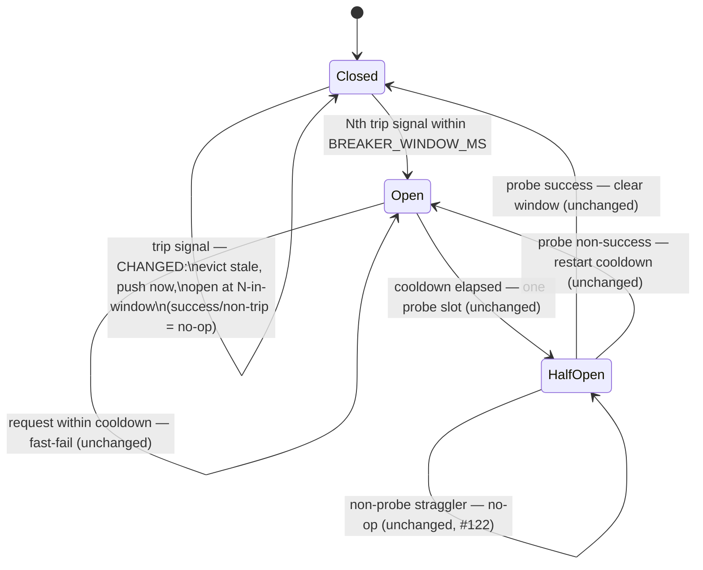

# fix: Circuit breaker windowed trip-signal counting (concurrency-robust)

## Summary

The per-process circuit breaker in `src/resilience.ts` trips on a **consecutive**
trip-signal counter (`consecutiveTripSignals`): five consecutive 429/503 signals open
it, and **any** success or non-trip outcome resets the counter to 0. That reset-on-success
rule is correct for a strictly serial request stream, but the MCP server is a long-lived
process with concurrent in-flight tool calls. `recordOutcome` runs after `await fetch`, so
a single interleaved success from any concurrent request zeroes the counter mid-storm — a
heavily interleaved 429/503 stream can take more than `BREAKER_THRESHOLD` signals to trip,
or fail to trip while occasional successes keep landing (issue #123).

This plan replaces the consecutive counter with a **sliding-window trip-signal count**:
trip when `BREAKER_THRESHOLD` trip signals fall within `BREAKER_WINDOW_MS`. Interleaved
successes become no-ops (they no longer reset progress); isolated 429s age out of the
window over time instead of being reset by an intervening success. The change is fully
contained in `src/resilience.ts` — `recordOutcome`/`breakerAllowsRequest` signatures are
unchanged, so `client.ts` needs no edits. The half-open single-probe gate (owner-scoped via
`isProbe`, fixed in #122) is untouched.

---

## Problem Frame

- **What breaks:** Under concurrent in-flight calls, the consecutive counter under-counts.
  A success interleaved into a 429/503 storm resets `consecutiveTripSignals` to 0, so the
  breaker may need more than `BREAKER_THRESHOLD` signals to open, or never open while
  sporadic successes keep arriving. This is the "two concurrent calls could both miss the
  threshold" case flagged in the original plan's System-Wide Impact section and documented
  inline in `recordOutcome` as best-effort-under-concurrency.
- **What does not break:** The half-open probe race was already closed in #122 (owner-scoped
  `recordOutcome` via `isProbe`, synchronous one-slot gate). The Closed-gate and Open-cooldown
  transitions are synchronous and correct. This plan changes **only** the Closed-state
  trip-counting logic.
- **Why it matters but was deferred:** The threat the breaker actually guards — a runaway
  agent loop hammering one rate-limited endpoint — is a dense stream of same-endpoint failures
  with few interleaved successes, so it still trips promptly today. The weakness bites only
  under healthy *mixed* concurrent traffic, where blanket fast-failing is itself less clearly
  desirable. This is preventive hardening with no observed incident, but the fix removes a
  latent correctness gap and adds the concurrent-execution test coverage the suite lacks.

---

## Requirements

| ID | Requirement | Source |
| --- | --- | --- |
| R1 | The breaker trips reliably under concurrent interleaved 429/503 load: an interleaved success must not reset progress toward tripping. | issue #123 acceptance 1 |
| R2 | The runaway-single-endpoint-loop case still trips within a comparable signal budget — the trip threshold stays at 5 signals. | issue #123 acceptance 2 |
| R3 | No regression to half-open probe semantics: owner-scoped `isProbe`, single-slot gate, reopen-on-non-success, close-on-success. | issue #123 acceptance 3 |
| R4 | Add concurrent-execution breaker test coverage (none exists today): a deterministic interleaved-outcome unit test **and** an un-awaited concurrent in-flight integration test. | issue #123 acceptance 1 (parenthetical) |
| R5 | The change stays encapsulated in `src/resilience.ts`; `recordOutcome` and `breakerAllowsRequest` signatures are unchanged so `src/client.ts` needs no edits. | derived (preserve the chokepoint seam) |
| R6 | The window size stays a centralized expert knob (hardcoded constant), not an env var, consistent with the other resilience tuning constants. | derived (matches KTD4 of origin plan) |
| R7 | Update the inline docs/comments describing the consecutive-counter behavior, including removing the best-effort-under-concurrency #123 caveat in `recordOutcome`. | derived (docs must not contradict code) |

---

## Key Technical Decisions

- **KTD1 — Sliding-window trip-signal count, not a failure-ratio breaker.** The window count
  is the minimal generalization of the existing consecutive counter: it keeps `BREAKER_THRESHOLD`
  semantics ("N trip signals to open"), adds exactly one new constant, and directly removes the
  reset-on-success dependency that causes the bug. A failure-ratio breaker (trip when failure
  rate over a min-volume window exceeds a threshold) requires tracking successes too, plus two
  more tuning knobs (min volume, ratio), and would change the breaker's character — it would
  *intentionally* tolerate a low rate of failures under healthy traffic, which is a larger
  design shift than this fix warrants. Ratio is documented under Alternatives Considered.

- **KTD2 — `BREAKER_WINDOW_MS = 30_000` (30s).** Chosen to comfortably exceed a dense storm's
  timescale while still aging out healthy-traffic 429 spacing. 30s aligns with `RETRY_BUDGET_MS`
  (the lifetime of a single logical request's retry loop), i.e., roughly "one storm's worth" of
  added wall-clock. A runaway loop or upstream burst produces trip signals densely (concurrent
  in-flight attempts land many signals in parallel), so 5 signals fall inside 30s easily;
  isolated 429s under healthy traffic are minutes apart and age out before accumulating to 5.
  This is the one value the implementer should validate against U2's window-aging and
  runaway-loop tests; treat the test outcomes as authoritative if 30s proves too tight or loose.

- **KTD3 — Successes and non-trip outcomes are no-ops while Closed (the core fix).** Today they
  reset the counter; under the window they do nothing. Aging-out via the window timestamp
  replaces reset-on-success as the mechanism that prevents isolated, time-separated 429s from
  ever accumulating to the threshold (preserving the "isolated 429s never accumulate" property
  of origin KTD7, but via time instead of an intervening success). This is what makes the
  breaker robust to interleaving.

- **KTD4 — State = a timestamp array, evicted on the record path.** Replace
  `consecutiveTripSignals: number` with `tripSignalTimestamps: number[]`. On a Closed trip
  signal: evict entries older than `nowMs - BREAKER_WINDOW_MS`, push `nowMs`, then open if
  `length >= BREAKER_THRESHOLD`. The array is naturally bounded — it only grows on trip signals
  while Closed, and the breaker opens (recording becomes a no-op) at the threshold, so it never
  holds many entries. Eviction runs only on the record path; if trips stop, a few stale
  timestamps linger harmlessly (they are never read again until the next trip's eviction pass).
  A bounded ring capped at `BREAKER_THRESHOLD` entries is an optional micro-optimization, not
  required for correctness.

- **KTD5 — Threshold stays `BREAKER_THRESHOLD = 5`.** Holding the threshold constant keeps the
  runaway-loop signal budget identical to today (R2): the 5th trip signal within the window
  opens the breaker, exactly as 5 consecutive signals do now. Only the reset-on-success
  dependency is removed.

- **KTD6 — Synchronous mutation invariant preserved.** `recordOutcome` and `breakerAllowsRequest`
  still mutate module state synchronously with no `await` between read and write (evict → push →
  compare is all synchronous). The concurrency-correctness property from the origin plan's
  System-Wide Impact ("breaker mutations must be synchronous") is retained; the fix is precisely
  that a success no longer participates in Closed-state mutation, so interleaving can only push
  the count up, never suppress it.

---

## High-Level Technical Design

The breaker **state machine is unchanged** — only the self-transition that counts trip signals
in the Closed state changes (consecutive counter → windowed timestamp count). The diagram below
shows where the change lands (annotated edge); every other edge is exactly as shipped in #122.

*Directional guidance for reviewers — not implementation specification.* The mermaid labels
describe behavior, not method bodies.

---

## Implementation Units

### U1. Replace the consecutive counter with a windowed trip-signal model in `src/resilience.ts`

- **Goal:** Make the Closed-state trip count robust to interleaving by counting trip signals
  within a sliding time window instead of requiring them to be consecutive.
- **Requirements:** R1, R2, R3, R5, R6, R7.
- **Dependencies:** none.
- **Files:**
  - `src/resilience.ts` (modify)
- **Approach:**
  - Add `export const BREAKER_WINDOW_MS = 30_000;` in the tuning-constants block, with a JSDoc
    explaining it is the sliding window over which `BREAKER_THRESHOLD` trip signals open the
    breaker (KTD2). Update `BREAKER_THRESHOLD`'s JSDoc from "Consecutive trip signals" to
    "Trip signals within `BREAKER_WINDOW_MS`".
  - Replace the module-level `let consecutiveTripSignals = 0;` with
    `let tripSignalTimestamps: number[] = [];` and update its comment.
  - Rewrite the **Closed** branch of `recordOutcome`: a success or non-trip outcome returns
    immediately as a no-op (KTD3); a trip signal evicts timestamps older than
    `nowMs - BREAKER_WINDOW_MS`, pushes `nowMs`, and opens the breaker (`breakerState = "Open"`,
    `openedAtMs = nowMs`) when `tripSignalTimestamps.length >= BREAKER_THRESHOLD` (KTD4).
  - In the **HalfOpen + isProbe success** path, clear the window (`tripSignalTimestamps = []`)
    where it currently sets `consecutiveTripSignals = 0`. The Open and non-probe-straggler
    branches are unchanged.
  - Update `resetCircuitBreakerState()` to clear the array (`tripSignalTimestamps = []`).
  - Rewrite the comments that describe the consecutive counter: the KTD7 inline block at the top
    of the breaker section, and the long `recordOutcome` JSDoc — **remove** the
    best-effort-under-concurrency NOTE that references #123 and replace it with the windowed-count
    description (R7). Do not interpolate any runtime value into comments.
  - Confirm `src/client.ts` is untouched: it only calls `breakerAllowsRequest`, `recordOutcome`,
    `getBreakerState`, and `classifyOutcome`, none of whose signatures change (R5).
- **Technical design (directional, not specification):** the Closed branch shifts from
  `if (success || !tripSignal) { counter = 0; return } counter++; if (counter >= THRESHOLD) open()`
  to `if (success || !tripSignal) return; evictOlderThan(now - WINDOW); push(now); if (count >= THRESHOLD) open()`.
- **Patterns to follow:** the existing module-state + `reset*State()` convention here and in
  `src/version-routing.ts`; the centralized-expert-knob constant style already in this file
  (`BREAKER_THRESHOLD`, `BACKOFF_CAP_MS`).
- **Test scenarios:** behavior is proven in U2 (this unit is the implementation). Sanity check
  during implementation: `npm run build` (tsc) is clean and the array type flows correctly.
  `Test expectation: none here — exercised by U2/U3.`
- **Verification:** `npm run build` passes; no remaining references to `consecutiveTripSignals`
  in `src/`; no comment in `resilience.ts` still describes consecutive counting or cites #123 as
  an open caveat.

### U2. Update and extend the breaker unit tests in `tests/unit/resilience.test.ts`

- **Goal:** Replace the tests that encode the old reset-on-success behavior, and prove the
  windowed model: interleaved successes do not prevent tripping, signals outside the window age
  out, and the threshold/half-open semantics are preserved.
- **Requirements:** R1, R2, R3, R4.
- **Dependencies:** U1.
- **Files:**
  - `tests/unit/resilience.test.ts` (modify)
- **Approach:** Rewrite the two existing tests that assert reset-on-success (the
  "a success resets the consecutive counter" and "a non-trip failure also resets the consecutive
  counter" cases) — under the windowed model these now assert the **opposite**: an interleaved
  success or non-trip outcome does **not** reset progress, so the storm still trips. Add the new
  window-aging and interleaving scenarios below. Import `BREAKER_WINDOW_MS`. Keep all half-open
  probe tests unchanged (they must stay green to prove R3).
- **Test scenarios:**
  - **Interleaved success still trips (R1).** Record `THRESHOLD-1` trip signals within the
    window, then a success (`isProbe` false, Closed), then one more trip signal, all within
    `BREAKER_WINDOW_MS` → state is `Open`. (Covers issue #123 acceptance 1.) This is the
    deterministic counterpart of the concurrency bug — under the old code the success would
    reset and the final trip would leave it Closed.
  - **Interleaved non-trip failure still trips (R1).** Same as above but the interleaved outcome
    is a non-trip failure (e.g. a 500/validation error) → `Open`.
  - **Threshold within window opens (R2, runaway loop).** `THRESHOLD` trip signals with strictly
    increasing timestamps spanning less than `BREAKER_WINDOW_MS` → `Open`; `THRESHOLD-1` →
    still `Closed`.
  - **Signals older than the window age out (KTD2/KTD3).** Record `THRESHOLD-1` trips at `T0`,
    then one trip at `T0 + BREAKER_WINDOW_MS + 1` → still `Closed` (the old ones evicted; only
    1 signal in the window).
  - **Isolated 429s spaced beyond the window never accumulate.** A sequence of single trips each
    more than `BREAKER_WINDOW_MS` apart → stays `Closed` indefinitely (assert across several).
  - **Boundary at exactly the window edge.** A trip at `T0` and a trip at exactly
    `T0 + BREAKER_WINDOW_MS` — assert the documented eviction boundary (`<=` vs `<`) matches U1's
    implementation; pin the chosen boundary in the test so it is intentional, not incidental.
  - **Half-open probe success clears the window (R3).** After opening, half-open, probe success
    → `Closed`; then `THRESHOLD-1` fresh trips stay `Closed` (window was cleared). (Adapts the
    existing "zeroes the counter" test to window semantics.)
  - **No regression (R3).** The existing half-open tests — single-probe gate, probe-429 reopen,
    probe non-success reopen+release, owner-scoped non-probe straggler no-op — remain unchanged
    and pass.
- **Verification:** `npx vitest run tests/unit/resilience.test.ts` passes; no test in the file
  still asserts that a success/non-trip outcome resets progress toward tripping.

### U3. Add an un-awaited concurrent in-flight integration test driving the breaker through the client

- **Goal:** Prove the fix on the real async path the bug lives on: multiple concurrent,
  un-awaited `client.request()` calls against an interleaved 429/200 stream open the breaker.
- **Requirements:** R1, R4.
- **Dependencies:** U1.
- **Files:**
  - `tests/integration/client.test.ts` (modify; add a focused `describe` block)
- **Approach:** Use `setupValidEnv()` and the `mockFetch` sequence helper. Stub a response
  sequence that interleaves at least one `200` among enough `429`s that `BREAKER_THRESHOLD`
  trip signals are guaranteed to land within `BREAKER_WINDOW_MS` regardless of scheduling order
  (the suite-wide no-op sleep seam keeps retries fast and within the window). Fire several GET
  `client.request()` calls **without awaiting individually**, then `await Promise.all(...)`. After
  they settle, assert the breaker opened — `getBreakerState() === "Open"` and/or a subsequent
  `client.request()` returns the `CIRCUIT_OPEN` error (not `RATE_LIMITED`). The interleaved `200`
  is the load-bearing element: under the old consecutive counter it would reset progress and the
  breaker might stay Closed; under the windowed model it is a no-op and the breaker opens.
- **Patterns to follow:** existing resilience-driving tests in `tests/integration/client.test.ts`
  and `tests/unit/client.test.ts`; the `mockFetch([...])` sequenced-response pattern in
  `tests/helpers/mockFetch.ts` (shared advancing `callIndex`); breaker-state reset is already
  wired globally in `tests/setup.ts`.
- **Test scenarios:**
  - **Concurrent interleaved storm opens the breaker (R1, R4).** N un-awaited concurrent GETs
    over an interleaved 429/200 sequence → after `Promise.all`, breaker is `Open` and a
    follow-up request fast-fails with `CIRCUIT_OPEN`. (Covers issue #123 acceptance 1; this is
    the "interleaves un-awaited in-flight calls" coverage the suite currently lacks.)
  - **Determinism guard.** Construct the mock sequence so the trip-signal count crossing the
    threshold within the window does not depend on event-loop interleaving order (e.g. enough
    429s that any scheduling yields ≥ `BREAKER_THRESHOLD` trips in-window). Avoid asserting on a
    specific interleaving the scheduler does not guarantee.
- **Verification:** `npx vitest run tests/integration/client.test.ts` passes deterministically
  across repeated runs (run it a few times locally to confirm no scheduling flakiness).

---

## Scope Boundaries

**In scope**
- Windowed trip-signal counting for the Closed state in `src/resilience.ts`.
- The new `BREAKER_WINDOW_MS` constant and updated `BREAKER_THRESHOLD` doc.
- Rewritten + added unit tests (U2) and a new concurrent integration test (U3).
- Comment/doc updates inside `resilience.ts`, including removing the #123 best-effort caveat.

**Non-goals (out of this product's identity for now)**
- A failure-ratio breaker (see Alternatives Considered).
- Exposing the window/threshold/cooldown as env vars — they remain centralized expert knobs (R6).
- Per-endpoint or per-account breakers — the breaker stays one-per-process (one STDIO process =
  one token = one account), unchanged.
- Any change to half-open probe semantics, cooldown, backoff, retry classification, or
  `Retry-After` parsing.

**Deferred to Follow-Up Work**
- Breaker telemetry/metrics (e.g. counting how often the window-trip fires vs the old path) — not
  required by the acceptance criteria; the existing stderr transition logging is sufficient.

---

## System-Wide Impact

- **`src/client.ts`: no change.** The breaker is fully encapsulated; the client passes only
  `{ isSuccess, isTripSignal }` to `recordOutcome` and reads `getBreakerState()`. Signatures are
  unchanged (R5). The per-attempt order in `sendWithResilience` (gate → attempt → classify+record
  → retry decision) is unaffected.
- **Telemetry/logging:** `logBreakerTransition` keys off `getBreakerState()` deltas, which still
  fire on Closed→Open and the half-open transitions. No log-format change; no secret-exposure
  surface touched.
- **`gen:docs`:** no impact — the breaker is not an MCP tool, so the README tool table and
  `bundle/manifest.json` are unaffected. No `npm run gen:docs` run required.
- **Config/env:** no new env var; `config.ts` and capability modes are untouched (R6).
- **Concurrency correctness:** the synchronous-mutation invariant is preserved (KTD6); the change
  strictly removes a suppression path (success no longer resets), so interleaving can only advance
  the count toward tripping, never away from it.

---

## Alternatives Considered

- **Failure-ratio breaker (trip when failure rate over a min-volume window exceeds a threshold).**
  Robust to interleaving like the windowed count, and arguably a better long-term model for mixed
  traffic, but it requires tracking successes as well as failures, adds two tuning knobs (minimum
  volume, ratio threshold), and changes the breaker's intent (it would deliberately tolerate a low
  failure rate under healthy load). That is a larger design decision than #123 calls for. The
  windowed count is the minimal change that satisfies all three acceptance criteria and keeps the
  threshold-count mental model. Ratio remains a sensible future evolution if mixed-traffic
  behavior ever needs tuning.
- **Keep the consecutive counter but guard mutation with a lock/mutex.** A single-threaded async
  runtime has no true data race to lock against; the issue is semantic (a success *legitimately*
  resets the counter), not a torn write. A lock would not change the outcome. Rejected.
- **Adopt a resilience library (`cockatiel`, `opossum`).** The original plan already weighed and
  rejected this for a single chokepoint with one well-understood failure surface; that reasoning
  stands. The windowed count is ~10 lines of change to existing, tested code.

---

## Risks & Mitigations

| Risk | Mitigation |
| --- | --- |
| Window too short → a real storm's 5 signals don't all land inside it → breaker fails to trip. | 30s comfortably exceeds the dense-storm timescale and aligns with `RETRY_BUDGET_MS`. U2's "threshold within window opens" test asserts the runaway-loop case trips at the 5th signal. |
| Window too long → isolated 429s under healthy traffic accumulate → false trip. | 30s ages out healthy-traffic 429 spacing (minutes apart). U2's "signals older than the window age out" and "isolated 429s never accumulate" tests assert this. |
| Existing tests encode the old reset-on-success semantics and would silently pass/fail-wrong if only *added* to. | U2 explicitly **rewrites** the two reset-on-success tests to assert the new (correct) behavior; verification checks no test still asserts reset-on-success. |
| Concurrent integration test (U3) flakiness from event-loop scheduling. | Design the mock sequence so ≥ `BREAKER_THRESHOLD` trips land in-window under any scheduling; the deterministic U2 unit test is the rigorous proof, U3 is the real-path smoke. Run U3 repeatedly to confirm stability. |
| `rtk`/vitest summary can mask a suite that fails to load. | Verify via raw exit code / `rtk proxy npx vitest run` (or plain `npx vitest run`), not the rtk `PASS (N)` summary, per the known test-infra footgun. |

---

## Verification

- `npm run build` — clean tsc.
- `npx vitest run tests/unit/resilience.test.ts tests/integration/client.test.ts` — all green,
  confirmed via raw exit code (not the rtk summary).
- `npm test` — full suite green (no regression elsewhere).
- Manual grep: no `consecutiveTripSignals` left in `src/`; no `#123` open-caveat comment left in
  `src/resilience.ts`.

---

## Sources & Research

- `src/resilience.ts` — current breaker implementation (consecutive counter, half-open gate,
  KTD7 comments, the inline #123 best-effort caveat in `recordOutcome`).
- `src/client.ts` `sendWithResilience` — the per-attempt gate→attempt→classify→record→retry loop
  that calls `recordOutcome`; confirms the client needs no change.
- `tests/unit/resilience.test.ts` — existing breaker tests, including the two reset-on-success
  tests this plan rewrites and the half-open tests that must stay green.
- `tests/helpers/mockFetch.ts` — sequenced-response mock (shared advancing `callIndex`) for U3.
- `tests/setup.ts` — global `resetCircuitBreakerState()` and no-op `setResilienceSleepForTests`
  wiring relied on by U2/U3.
- `docs/plans/2026-06-14-003-feat-resilient-request-core-plan.md` — origin design (KTD7, the
  System-Wide Impact "breaker mutations must be synchronous" note, the deferred concurrency half).
- GitHub issue #123 (acceptance criteria) and #122 (the half-open probe-hijack fix that this plan
  must not regress).
- External research: not run. Strong local pattern (the existing breaker + `version-routing.ts`
  module-state convention) and a well-understood algorithm space already framed by the issue.
