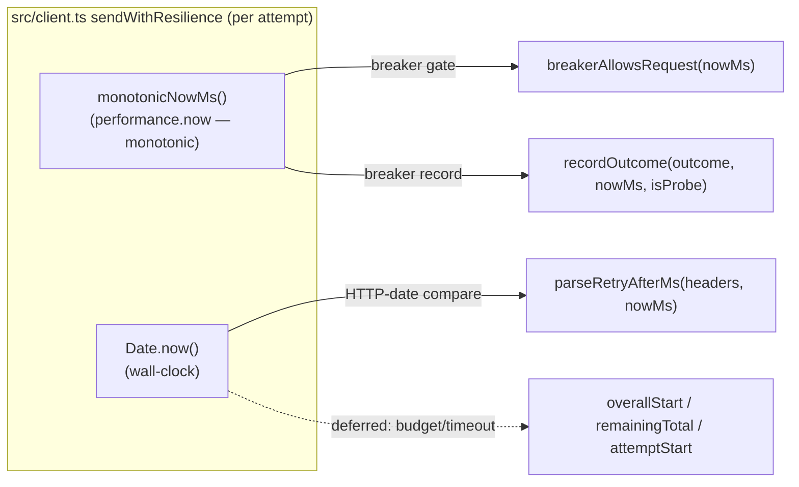

# fix: Circuit breaker keys window/cooldown on a monotonic clock

## Summary

The per-process circuit breaker in `src/resilience.ts` is already a pure function of an
injected `nowMs`: `breakerAllowsRequest(nowMs)` does the Open→HalfOpen cooldown math, and
`recordOutcome(outcome, nowMs, isProbe)` does the sliding-window trip count. The bug is not
in the breaker — it is that `src/client.ts` feeds those two call sites `Date.now()`, which is
**wall-clock and non-monotonic**. A forward NTP/VM clock step larger than `BREAKER_WINDOW_MS`
(30s) mid-storm advances the eviction cutoff past still-recent trip-signal timestamps and
evicts an in-progress storm, so the breaker fails to open that round; a backward step leaves
future-dated entries that resist eviction and shifts the cooldown deadline.

This plan routes the breaker's clock through a **monotonic source** (`performance.now()`),
injected via a module-level seam in `src/resilience.ts` that mirrors the existing
`setResilienceSleepForTests` seam. The client reads that seam for the breaker gate and record;
`parseRetryAfterMs` keeps `Date.now()` (it compares against server-supplied HTTP-dates and
must stay wall-clock). The breaker functions and their `nowMs` parameter are unchanged, so the
existing deterministic breaker unit tests (which pass fixed `T0` values) keep passing
untouched. New tests prove a hostile wall-clock no longer affects trip-counting or cooldown
timing.

---

## Problem Frame

- **What breaks:** `src/client.ts` `sendWithResilience` calls `breakerAllowsRequest(Date.now())`
  (gate) and `recordOutcome({ ... }, Date.now(), isProbe)` (record). `Date.now()` is
  wall-clock. Two constructible (low-probability) failure modes, both noted in issue #133:
  - **Forward jump > 30s mid-storm:** the Closed-branch eviction in `recordOutcome`
    (`tripSignalTimestamps.filter(ts => ts >= nowMs - BREAKER_WINDOW_MS)`) drops still-recent
    trip signals, so the in-progress storm loses accumulated signals and the breaker fails to
    open that round (fail-open for one window).
  - **Backward jump:** leaves future-dated window entries that resist eviction, and shifts the
    `nowMs - openedAtMs >= BREAKER_COOLDOWN_MS` cooldown deadline so the probe is handed out
    too early or too late.
- **What does not break:** The breaker's logic is correct for any monotonic `nowMs` it is
  given — the half-open single-probe gate (owner-scoped via `isProbe`, #122) and the windowed
  trip count (#123/#134) are sound. This plan changes **only the clock source the client feeds
  the breaker**, not the breaker's decision logic.
- **Why it matters but was deferred from #123:** Low probability (needs an NTP/VM step >30s
  precisely during an active storm) and a mild fail direction (worst case is "fails to trip
  once" or a mis-timed cooldown — not data loss, corruption, or a hang). The robust fix is a
  deliberate clock-source change with its own test fixtures, worth doing on its own rather than
  bolted onto #123's windowed-counter scope. The cooldown half of the bug predates #123 — the
  `openedAtMs` cooldown has always used `Date.now()`.

---

## Requirements

| ID | Requirement | Source |
| --- | --- | --- |
| R1 | A forward wall-clock (`Date.now`) jump larger than `BREAKER_WINDOW_MS` mid-storm must NOT prevent the breaker from tripping — the windowed trip count keys off a monotonic clock. | issue #133 acceptance 1 |
| R2 | The Open→HalfOpen cooldown timing must be unaffected by wall-clock steps (forward or backward) — it keys off the monotonic clock. | issue #133 acceptance 2 |
| R3 | No regression to the windowed-count or half-open probe semantics (single-probe gate, owner-scoped `isProbe`, reopen-on-non-success, close-on-success, threshold = 5, window aging). | issue #133 acceptance 3 |
| R4 | Add a non-monotonic-clock test — the current suite only feeds non-decreasing `nowMs`. Prove the breaker still trips and cools down correctly when the wall-clock (`Date.now`) is made hostile. | issue #133 acceptance 1 (parenthetical) |
| R5 | Keep the injectable clock seam for tests. The breaker functions remain pure functions of `nowMs`; the monotonic clock source is chosen at the client call site / via an injectable seam. | issue #133 ("keeping the injectable-`nowMs` seam for tests") |
| R6 | `parseRetryAfterMs` must continue to use wall-clock (`Date.now`) — it compares against server-supplied `Retry-After` HTTP-dates. It must NOT be moved to the monotonic clock. | derived (correctness boundary) |
| R7 | Update comments/docs that describe the breaker timestamps as "wall-clock" so docs do not contradict code. | derived (docs must match code) |

---

## Key Technical Decisions

- **KTD1 — Monotonic source is `performance.now()`.** It returns float milliseconds relative
  to process start, is monotonically non-decreasing and immune to system-clock adjustments, and
  is a Node global (no import needed, matching the codebase's use of `fetch` / `Headers` /
  `AbortSignal`). It is the same unit (ms) as the existing breaker arithmetic, so it is a true
  drop-in — the `>=` window/cooldown comparisons work unchanged on floats. Rejected
  `process.hrtime.bigint()` (nanosecond `bigint`) for the type friction it forces on every
  arithmetic site and the `nowMs: number` signature. See Alternatives.

- **KTD2 — Inject the monotonic clock via a module-level seam in `src/resilience.ts`,
  mirroring the sleep seam.** Add `monotonicNowMs()` (default `() => performance.now()`),
  `setMonotonicClockForTests(fn)`, and `resetMonotonicClockForTests()`, modeled exactly on
  `resilientSleep` / `setResilienceSleepForTests` / `resetResilienceSleepForTests`. The client
  calls `monotonicNowMs()` for the breaker gate and record. The seam exists because the 60s
  cooldown and the 30s window-aging are not testable in real wall-clock time, and because it
  lets a test drive a controlled monotonic clock *independently* of a hostile `Date.now` — the
  precise divergence the bug is about. This is the same category of test-only seam as
  `resetCircuitBreakerState()` / the sleep seam: a reset/override that lives in production for
  isolation, not a behavior change. (The plan already rejected fake timers for the sleep seam
  for the same async-interleaving reasons; the same reasoning applies here.)

- **KTD3 — Scope: only the breaker gate/record move to monotonic.** `parseRetryAfterMs` stays
  on `Date.now()` (R6 — it subtracts a server `Retry-After` HTTP-date, which is wall-clock; a
  monotonic value there would be meaningless). The retry-budget / per-attempt-timeout elapsed
  arithmetic in `sendWithResilience` (`overallStartMs`, `remainingTotalMs`, `attemptStartMs`,
  `budgetUsedMs`) also uses `Date.now()` and shares the same root cause, but is **deferred**:
  it is outside the issue's stated breaker scope, its worst case is bounded by
  `RETRY_MAX_ATTEMPTS` (4) regardless of clock movement, and it fails toward surfacing the
  error sooner. Documented under Deferred to Follow-Up Work so the two clocks living in one
  function is an explicit, reviewed choice, not an oversight.

- **KTD4 — Keep the `nowMs: number` parameter on `breakerAllowsRequest` / `recordOutcome`.** Do
  NOT have the breaker read the clock internally. The parameter IS the seam the issue asks to
  preserve (R5): the existing breaker unit tests pass fixed `T0` values and are fully
  deterministic with zero clock dependency. Changing the breaker to self-read the clock would
  force rewriting every breaker unit test and couple the pure decision logic to a clock. The
  fix is precisely that the *client's choice of which clock to read* was wrong; the breaker is
  already right.

- **KTD5 — Defer the optional epoch/generation straggler-seeding guard.** Finding A2 from the
  #123 review (a pre-open straggler trip settling *after* a successful half-open probe could
  seed the freshly-cleared window) is P3, suppressed at low confidence, and orthogonal to the
  clock source — the monotonic change neither fixes nor worsens it. Bundling it would dilute a
  clean clock-source fix. Deferred to Follow-Up Work.

---

## High-Level Technical Design

The breaker **state machine is unchanged** (windowed count + half-open gate as shipped in
#122/#123/#134). The only change is the *clock source* the client supplies to the two breaker
entry points. The map below is the load-bearing decision — which call sites move to monotonic
and which deliberately stay wall-clock (R6):

| Call site in `src/client.ts` `sendWithResilience` | Arithmetic | Clock source | Change |
| --- | --- | --- | --- |
| `breakerAllowsRequest(...)` (gate) | `nowMs - openedAtMs >= BREAKER_COOLDOWN_MS` | **monotonic** (`monotonicNowMs()`) | **CHANGED** from `Date.now()` |
| `recordOutcome({ ... }, ..., isProbe)` (record) | window eviction `ts >= nowMs - BREAKER_WINDOW_MS` + `openedAtMs = nowMs` | **monotonic** (`monotonicNowMs()`) | **CHANGED** from `Date.now()` |
| `parseRetryAfterMs(headers, ...)` | `Math.max(0, httpDateMs - nowMs)` | **wall-clock** (`Date.now()`) | unchanged (R6 — must stay wall-clock) |
| `overallStartMs` / `remainingTotalMs` / `attemptStartMs` / `budgetUsedMs` (retry budget + timeout) | elapsed duration | wall-clock (`Date.now()`) | unchanged this PR (deferred — same root cause, bounded by `RETRY_MAX_ATTEMPTS`) |

*Directional guidance for reviewers — not implementation specification.* The two clocks never
share a subtraction: breaker arithmetic only subtracts monotonic-sourced values, budget
arithmetic only subtracts wall-clock-sourced values, so mixing the two unit origins is safe.

---

## Implementation Units

### U1. Route the breaker's clock through a monotonic seam (`src/resilience.ts` + `src/client.ts` + test wiring)

- **Goal:** Make the breaker's window/cooldown arithmetic immune to wall-clock steps by feeding
  it a monotonic clock, injected via a seam, while leaving the breaker's decision logic and the
  `Retry-After` wall-clock comparison untouched.
- **Requirements:** R1, R2, R3, R5, R6, R7.
- **Dependencies:** none.
- **Files:**
  - `src/resilience.ts` (modify — add the monotonic-clock seam; sync the breaker comments)
  - `src/client.ts` (modify — feed `monotonicNowMs()` to the two breaker call sites)
  - `tests/setup.ts` (modify — reset the clock seam in `beforeEach`)
- **Approach:**
  - In `src/resilience.ts`, add a monotonic-clock seam directly modeled on the existing sleep
    seam block (`SleepFn` / `realSleep` / `sleepImpl` / `resilientSleep` /
    `setResilienceSleepForTests` / `resetResilienceSleepForTests`):
    - `export type MonotonicClock = () => number;`
    - `const realMonotonicNow: MonotonicClock = () => performance.now();`
    - a module-level `let monotonicImpl = realMonotonicNow;`
    - `export function monotonicNowMs(): number` returning `monotonicImpl()`
    - `export function setMonotonicClockForTests(fn: MonotonicClock): void`
    - `export function resetMonotonicClockForTests(): void`
    - JSDoc explaining: the breaker keys its window/cooldown on a *monotonic* process-relative
      clock so a wall-clock (`Date.now`) step cannot evict an in-progress window or mis-time the
      cooldown (#133); the seam exists because the 60s cooldown / 30s window are not testable in
      real time and to drive a controlled monotonic clock independently of a hostile `Date.now`.
  - Update the breaker state-variable comments in `src/resilience.ts` so docs match code (R7):
    `tripSignalTimestamps` ("Wall-clock ms timestamps…" → "Monotonic process-relative ms
    timestamps…"), `openedAtMs` ("Wall-clock ms when the breaker last opened" → "Monotonic
    process-relative ms when the breaker last opened"), and a one-line note in the breaker
    section header that the client supplies a monotonic clock (so a wall-clock step is inert).
    Do not interpolate any runtime value into comments. The breaker functions themselves
    (`breakerAllowsRequest`, `recordOutcome`, `getBreakerState`, `resetCircuitBreakerState`) and
    the `nowMs: number` parameter are **unchanged** (KTD4).
  - In `src/client.ts` `sendWithResilience`: import `monotonicNowMs` alongside the existing
    resilience imports; replace `breakerAllowsRequest(Date.now())` with
    `breakerAllowsRequest(monotonicNowMs())` and `recordOutcome({ ... }, Date.now(), isProbe)`
    with `recordOutcome({ ... }, monotonicNowMs(), isProbe)`. Leave
    `parseRetryAfterMs(responseHeaders ?? EMPTY_HEADERS, Date.now())` on `Date.now()` and add a
    brief inline comment that it intentionally stays wall-clock because it compares against a
    server `Retry-After` HTTP-date (R6). Leave the budget/timeout `Date.now()` arithmetic
    unchanged (deferred per KTD3); a one-line comment noting the deferral is optional.
  - In `tests/setup.ts` `beforeEach`, call `resetMonotonicClockForTests()` alongside the
    existing `resetCircuitBreakerState()` / `setResilienceSleepForTests(...)` calls, with a
    comment matching the existing module-state-leak rationale, so a test that overrides the
    clock cannot bleed into the next.
- **Technical design (directional, not specification):** the seam is a byte-for-byte structural
  copy of the sleep seam already in this file. Client edit is two argument swaps
  (`Date.now()` → `monotonicNowMs()`) at the gate and record sites only.
- **Patterns to follow:** the `setResilienceSleepForTests` / `resetResilienceSleepForTests`
  seam and its `tests/setup.ts` wiring (the exact template); the `resetCircuitBreakerState()` /
  `resetVersionRoutingState()` module-state reset convention; the codebase's use of Node
  globals (`fetch`, `Headers`, `AbortSignal`) rather than explicit imports.
- **Test scenarios:** behavior is proven in U2; this unit is the implementation.
  `Test expectation: none here — exercised by U2.` Sanity during implementation: `npm run build`
  (tsc) is clean and `performance.now()` resolves as a global under the project's `@types/node`.
- **Verification:** `npm run build` passes; `src/client.ts` no longer passes `Date.now()` to
  `breakerAllowsRequest` / `recordOutcome` but still passes it to `parseRetryAfterMs`; no
  comment in `src/resilience.ts` still calls the breaker timestamps "wall-clock".

### U2. Prove the fix with non-monotonic-clock tests (`tests/unit/resilience.test.ts` + `tests/integration/client.test.ts`)

- **Goal:** Add the missing non-monotonic-clock coverage: a hostile `Date.now` no longer
  affects trip-counting (R1) or cooldown timing (R2), and existing breaker/probe semantics do
  not regress (R3).
- **Requirements:** R1, R2, R3, R4.
- **Dependencies:** U1.
- **Files:**
  - `tests/unit/resilience.test.ts` (modify — seam sanity + clock-source assertions)
  - `tests/integration/client.test.ts` (modify — add a focused `describe` block driving the
    breaker through the client with divergent clocks)
- **Approach:** At the client level, install a controlled monotonic clock via
  `setMonotonicClockForTests` and independently make `Date.now` hostile via
  `vi.spyOn(Date, 'now')` (restored by the global `vi.restoreAllMocks()` in `afterEach`). Hold
  the monotonic clock in-window/at-cooldown-boundary while `Date.now` jumps, then assert breaker
  outcomes — the breaker can only behave correctly if the client reads the seam, not `Date.now`.
  Drive trip signals through real `client.request()` GET calls over a `mockFetch` 429 sequence
  (the suite-wide no-op sleep seam keeps retries instant). Reset the breaker between cases (the
  global `resetCircuitBreakerState()` already runs in `beforeEach`). Keep all existing breaker
  unit tests in `resilience.test.ts` unchanged — they pass fixed `nowMs` and must stay green to
  prove R3.
- **Test scenarios:**
  - **Monotonic seam sanity (unit).** `monotonicNowMs()` returns non-decreasing values across
    two real calls; `setMonotonicClockForTests(() => 42)` makes it return `42`;
    `resetMonotonicClockForTests()` restores the real `performance.now`-backed source. (Covers R5.)
  - **Forward wall-clock jump mid-storm still trips (integration, R1, R4).** Install a monotonic
    clock returning tightly-clustered increasing values all inside `BREAKER_WINDOW_MS`; spy
    `Date.now` to jump forward by `> BREAKER_WINDOW_MS` partway through. Fire enough GET requests
    over a 429 `mockFetch` sequence that `≥ BREAKER_THRESHOLD` trip signals land. Assert
    `getBreakerState() === 'Open'` and a follow-up request returns `CIRCUIT_OPEN` (not
    `RATE_LIMITED`). Under the old code (breaker on `Date.now`) the forward jump would evict
    mid-storm and leave it Closed; under the fix it opens. (Covers issue #133 acceptance 1.)
  - **Monotonic spread ages signals out even when `Date.now` is held constant (integration,
    R1).** The converse guard: install a monotonic clock that advances `> BREAKER_WINDOW_MS`
    between each trip while `Date.now` is pinned constant/in-window. Assert the breaker stays
    `Closed` across many trips. This proves the breaker genuinely keys off the monotonic seam,
    not `Date.now` (otherwise a constant `Date.now` would keep them in-window and trip).
  - **Cooldown keys off the monotonic clock, not the wall-clock (integration, R2, R4).** Open
    the breaker (monotonic at `M0`). With `Date.now` spied to a wildly different value (both a
    large forward jump and a backward step, across two assertions), drive the gate via
    `client.request()`: monotonic at `M0 + BREAKER_COOLDOWN_MS - 1` → request fast-fails
    `CIRCUIT_OPEN` (still Open); monotonic at `M0 + BREAKER_COOLDOWN_MS` → the probe is handed
    out (state `HalfOpen`). The cooldown boundary tracks monotonic time regardless of `Date.now`.
    (Covers issue #133 acceptance 2.)
  - **No regression (R3).** The full existing breaker unit suite in `resilience.test.ts`
    (threshold/window opening, aging-out, isolated-429 non-accumulation, window-edge boundary,
    single-probe gate, probe-429/non-success reopen+release, owner-scoped straggler no-op,
    reset) remains unchanged and green.
  - **Determinism guard.** Construct each integration case so the in-window vs aged-out outcome
    is fixed by the controlled monotonic clock, not by event-loop scheduling or by how many
    retries a single request happens to make. Prefer firing enough discrete requests that
    `≥ BREAKER_THRESHOLD` in-window trips are guaranteed under any scheduling.
- **Verification:** `npx vitest run tests/unit/resilience.test.ts tests/integration/client.test.ts`
  passes (confirmed via raw exit code, not the rtk summary), repeatably across a few runs; no
  existing breaker unit test was weakened to accommodate the new clock source.

---

## Scope Boundaries

**In scope**
- A monotonic-clock seam (`monotonicNowMs` / `setMonotonicClockForTests` /
  `resetMonotonicClockForTests`) in `src/resilience.ts`, modeled on the sleep seam.
- `src/client.ts` feeding `monotonicNowMs()` to `breakerAllowsRequest` and `recordOutcome`.
- `tests/setup.ts` reset wiring for the new seam.
- Comment/doc sync in `src/resilience.ts` (timestamps are monotonic, not wall-clock).
- New non-monotonic-clock tests proving R1/R2/R4 and confirming R3 no-regression.

**Non-goals (out of this product's identity for now)**
- Moving `parseRetryAfterMs` off `Date.now()` — it must stay wall-clock to compare against
  server `Retry-After` HTTP-dates (R6).
- Exposing the window/threshold/cooldown or the clock source as env vars — they remain
  centralized expert knobs / internal seams.
- Any change to the breaker decision logic, threshold (5), window (30s), cooldown (60s),
  half-open probe semantics, backoff, retry classification, or `Retry-After` parsing.
- Per-endpoint / per-account breakers — the breaker stays one-per-process.

**Deferred to Follow-Up Work**
- **Retry-budget / per-attempt-timeout elapsed arithmetic on a monotonic clock.** The
  `overallStartMs` / `remainingTotalMs` / `attemptStartMs` / `budgetUsedMs` math in
  `sendWithResilience` shares the same `Date.now()` root cause, but is bounded by
  `RETRY_MAX_ATTEMPTS` (4) regardless of clock movement and fails toward surfacing sooner. Out
  of this issue's stated breaker scope (KTD3) — a candidate follow-up for full
  monotonic-elapsed-time hygiene.
- **Epoch/generation straggler-seeding guard (finding A2, P3).** A counter incremented on each
  Open→Closed transition, captured at gate time and checked in the Closed record branch, to
  stop a pre-open straggler trip from seeding a freshly-cleared window after a half-open probe
  success. Orthogonal to the clock source; low confidence (KTD5).

---

## System-Wide Impact

- **`src/client.ts`:** two argument swaps at the breaker call sites plus one new import and one
  clarifying comment. The per-attempt order (gate → attempt → classify+record → retry decision)
  is unaffected. The retry budget/timeout path is untouched (deferred).
- **`src/resilience.ts`:** additive (a new seam block) plus comment edits; no breaker-function
  signature or logic change, so every existing consumer and test of the breaker is unaffected.
- **Telemetry/logging:** `logBreakerTransition` keys off `getBreakerState()` deltas, which are
  unchanged. No log-format change; no secret-exposure surface touched.
- **`gen:docs`:** no impact — the breaker and the seam are not MCP tools, so the README tool
  table and `bundle/manifest.json` are unaffected. No `npm run gen:docs` run required.
- **Config/env:** no new env var; `config.ts` and capability modes untouched.
- **Test isolation:** the new clock seam is module-level mutable state, so it MUST be reset in
  `tests/setup.ts` `beforeEach` (same footgun class as `resetCircuitBreakerState` /
  `resetVersionRoutingState` / the sleep seam). U1 wires this.
- **Concurrency correctness:** unchanged. The synchronous-mutation invariant
  (no `await` between breaker read and write) holds; `monotonicNowMs()` is a synchronous call.

---

## Alternatives Considered

- **`process.hrtime.bigint()` instead of `performance.now()`.** Also monotonic, but returns
  nanoseconds as a `bigint`, forcing a `/ 1_000_000` conversion and a `bigint`→`number` cast at
  every site and changing the `nowMs: number` contract. `performance.now()` is monotonic, float
  ms (same unit as today), and a Node global — a true drop-in. Rejected for friction with no
  benefit at this precision.
- **Have the breaker read the clock internally (drop the `nowMs` parameter).** Would couple the
  pure decision logic to a clock and force rewriting every existing breaker unit test (they pass
  fixed `T0`). The parameter is the very seam the issue asks to preserve (R5). Rejected (KTD4).
- **Control time with vitest fake timers instead of a seam.** The resilient-request plan already
  rejected fake timers for the sleep seam due to async-interleaving awkwardness, and fake timers
  also fake `performance.now`, making it hard to diverge the monotonic clock from `Date.now`
  (the exact thing under test). A plain injectable seam is simpler and consistent with the
  existing sleep seam. Rejected.
- **Fix the retry budget in the same PR.** Same root cause, but out of the issue's breaker
  scope, bounded by `RETRY_MAX_ATTEMPTS`, and it would widen a clean clock-source change.
  Deferred, not rejected.

---

## Risks & Mitigations

| Risk | Mitigation |
| --- | --- |
| `performance.now()` not available / typed in the project's Node + `@types/node`. | Node global since v16; project floor is Node 22 with `@types/node@^22`. U1 verifies with a clean `npm run build` (tsc). |
| Two clocks (monotonic for breaker, wall-clock for budget/`Retry-After`) in one function confuse a reader. | The HTD clock-source map documents the boundary; an inline comment marks `parseRetryAfterMs` as deliberately wall-clock; the two clocks never share a subtraction. |
| New module-level seam leaks across tests in a worker. | `resetMonotonicClockForTests()` wired into `tests/setup.ts` `beforeEach` (U1), mirroring the breaker/version-routing/sleep resets. |
| Integration tests flaky from event-loop scheduling or per-request retry count. | The controlled monotonic seam fixes the in-window/aged-out outcome deterministically; design the mock so `≥ BREAKER_THRESHOLD` in-window trips land under any scheduling; run repeatedly to confirm. |
| `rtk`/vitest summary can mask a suite that fails to load. | Verify via raw exit code / `rtk proxy npx vitest run` (or plain `npx vitest run`), not the rtk `PASS (N)` summary. |
| A reviewer reads the breaker change as logic change rather than clock-source change. | Breaker functions and signatures are byte-for-byte unchanged except comments; the diff is the seam + two client argument swaps. |

---

## Verification

- `npm run build` — clean tsc; `performance.now()` resolves as a global.
- `npx vitest run tests/unit/resilience.test.ts tests/integration/client.test.ts` — green,
  confirmed via raw exit code (not the rtk summary), repeated a few times for the integration
  cases.
- `npm test` — full suite green (no regression elsewhere).
- Manual grep: `src/client.ts` passes `monotonicNowMs()` (not `Date.now()`) to
  `breakerAllowsRequest` / `recordOutcome`, and still passes `Date.now()` to
  `parseRetryAfterMs`; no comment in `src/resilience.ts` calls the breaker timestamps
  "wall-clock".

---

## Sources & Research

- `src/resilience.ts` — breaker (`breakerAllowsRequest`, `recordOutcome`, `tripSignalTimestamps`,
  `openedAtMs`, `BREAKER_WINDOW_MS`, `BREAKER_COOLDOWN_MS`) and the `setResilienceSleepForTests`
  sleep seam that the new monotonic seam mirrors exactly.
- `src/client.ts` `sendWithResilience` — the per-attempt loop with the two breaker `Date.now()`
  call sites (gate, record), the `parseRetryAfterMs(headers, Date.now())` call that must stay
  wall-clock, and the deferred budget/timeout `Date.now()` arithmetic.
- `tests/unit/resilience.test.ts` — existing breaker unit tests (fixed `T0`, non-decreasing
  `nowMs`) that prove R3 and stay unchanged.
- `tests/integration/client.test.ts` — resilience-driving integration tests and the `mockFetch`
  sequence helper used by the new clock-source tests.
- `tests/setup.ts` — global `resetCircuitBreakerState()` / `resetVersionRoutingState()` /
  no-op `setResilienceSleepForTests` wiring the new `resetMonotonicClockForTests()` joins.
- `docs/plans/2026-06-16-001-fix-circuit-breaker-windowed-plan.md` and
  `docs/plans/2026-06-14-003-feat-resilient-request-core-plan.md` — windowed-count and original
  resilience design (KTD7, the sleep-seam-over-fake-timers decision, synchronous-mutation
  invariant).
- GitHub issue #133 (acceptance criteria, the deferred-from-#123 framing, the optional A2
  guard), refs #122 (half-open probe-hijack fix) and #123/#134 (windowed counter) this plan
  must not regress.
- External research: not run. Strong local pattern (the sleep seam is an exact template) and a
  well-understood, single-decision change (`Date.now` → monotonic clock) already framed by the
  issue.
